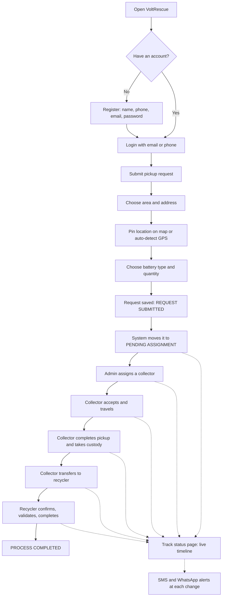
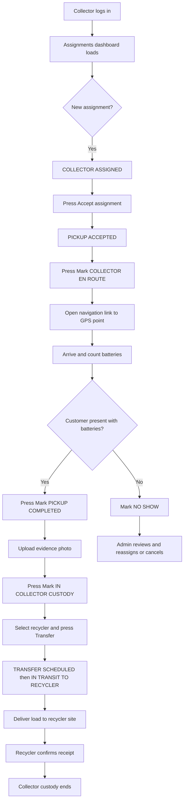
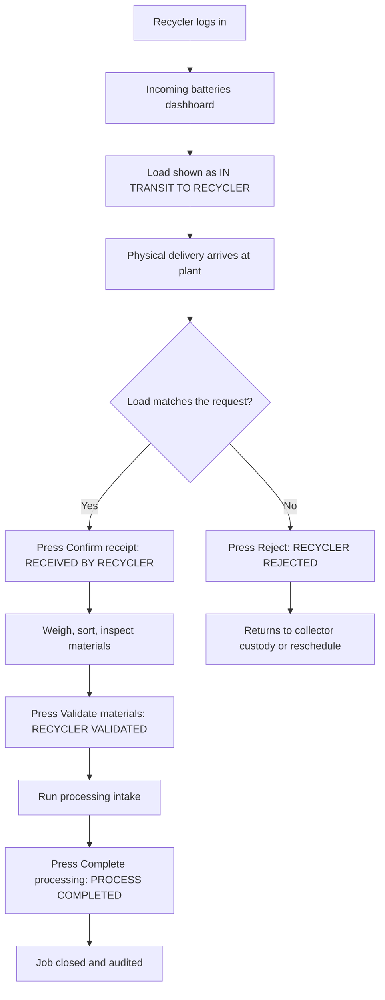
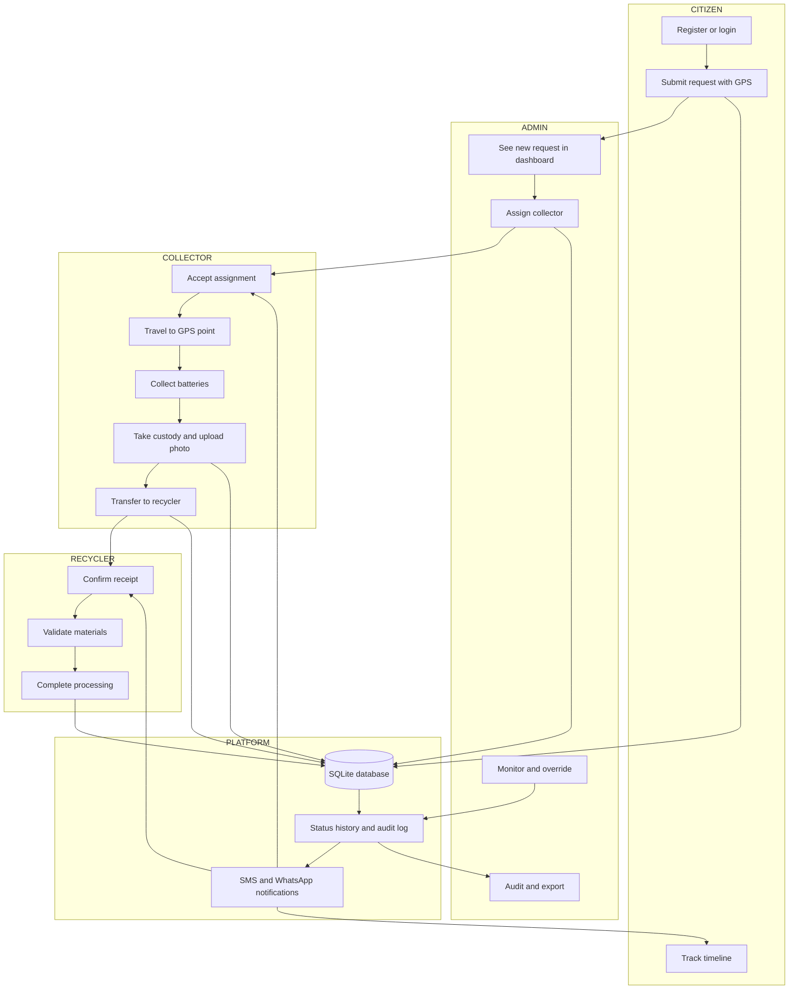
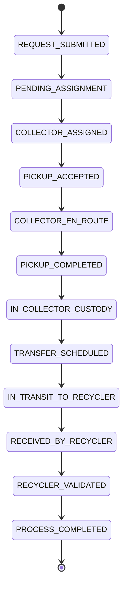
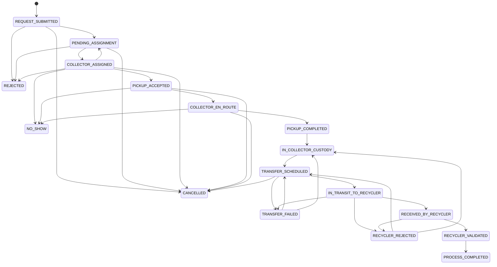
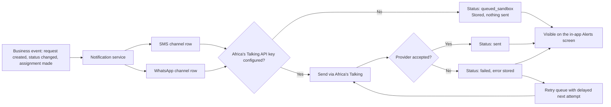

# VoltRescue — Business Process Flow & Flowchart Guide

**Document 1 of 3** · Business process and operations
**Audience:** Supervisor (Mr. Menelick Erick), operations staff, product owners, recycling partners, municipal stakeholders
**System version:** VoltRescue POC — Dar es Salaam pilot, Phase 1
**Application URL (local):** `http://127.0.0.1:8815/`
**Source of truth:** SQLite database `data/voltrescue.sqlite`, reached only through the REST API
**Companion documents:** `02_VoltRescue_User_Guide.md` (how to use it), `03_VoltRescue_Technical_Design_Handbook.md` (how it is built)

> **Reading note.** Diagrams in this file use Mermaid. If your Markdown preview shows a resource error, open the file as plain text; the diagram source is still readable line by line.

---

## Table of contents

1. Solution Overview
2. Citizen / User Journey
3. Collector Journey
4. Recycler Journey
5. Admin Journey
6. End-to-End Flowchart
7. Status Lifecycle Diagram
8. Notification Flow
9. Business Rules
10. Operational Workflow Summary

---

## 1. Solution Overview

### 1.1 What VoltRescue is

VoltRescue is a **battery reverse-logistics platform**. It moves spent batteries from the household or small business that owns them, through a named collector, into the hands of a licensed recycling partner — and records every step of that journey as a permanent database record.

The Phase 1 POC is a single web application. Citizens, collectors, recycler staff, and administrators all open the same address and log in; the menu and dashboard they see are decided by the role stored against their account. The interface is dark-themed and mobile-first, because collectors work from phones in the field.

Four things make it a platform rather than a form:

- **One request record.** Every pickup exists once, with an ID, a GPS point, a battery type, a quantity, and an owner.
- **A forced lifecycle.** A request cannot jump from "submitted" to "completed". It must pass through each stage, and each stage is stamped with who changed it and when.
- **A chain of custody.** The system knows which collector physically holds the batteries and which recycler received them.
- **An audit trail.** Every login, creation, assignment, status change, upload, and override writes an audit row that an administrator can read later.

### 1.2 The business problem it solves

Spent lead-acid and lithium batteries in Dar es Salaam are largely collected informally. Coordination happens over phone calls and WhatsApp messages. This creates four operational problems:

| Problem | Consequence today | How VoltRescue answers it |
|---|---|---|
| No single request record | Requests are lost in chat history; nobody knows the backlog | Every request is a database row with a status and an owner |
| No proof of custody | If a load disappears between household and recycler, nobody can say who held it | `assignments` and `custody_transfers` name the collector and the recycler with timestamps |
| No location data | Collectors phone the customer repeatedly for directions | GPS coordinates are captured on the map and turned into navigation links |
| No oversight | Management cannot answer "how many pickups today, how many stuck" | Admin dashboard with live counters, search, filter, and CSV export |

### 1.3 Objectives of the POC

The POC was built to demonstrate, with working software rather than slides, that:

1. A citizen can submit a pickup request that **persists in a database**, not just in a browser tab.
2. An administrator can **assign work** to a named collector and see the whole operation.
3. A collector can **accept, travel, collect, and transfer custody** from a phone.
4. A recycler can **confirm receipt, validate materials, and close** the job.
5. **Illegal status jumps are rejected** by the server unless an administrator deliberately overrides them.
6. Notification, mobile-money, and mapping integrations have **real architectural hooks** — sandbox-ready, with no live money movement.

### 1.4 Scope covered in Phase 1

| Included and working | Excluded from Phase 1 (architecture hooks only) |
|---|---|
| Registration, login, password reset, profile editing | AI battery image recognition |
| Pickup request capture with GPS pin and auto-detect | AI scrap-value prediction |
| Collector assignment and workload visibility | Rewards / points engine |
| Complete 12-stage pickup and custody lifecycle | Recycling certificates |
| Recycler receipt, validation, and completion | Carbon credits and sustainability impact reports |
| Admin KPIs, search, filter, sort, pagination, CSV export | Advanced analytics and commercial BI dashboards |
| Status override with audit record | Machine learning of any kind |
| SMS and WhatsApp notification framework (Africa's Talking) | Live mobile-money payouts |
| M-Pesa **sandbox** connector — no live debit | Public internet deployment |
| Evidence photo uploads with preview | Email channel |
| Full audit logging | |

**Nothing in the excluded column is faked in the user interface.** There are no buttons that pretend to score a battery or issue a certificate.

### 1.5 The four roles at a glance

| Role | Who they are | Core responsibility |
|---|---|---|
| **Citizen / User** | Household or small business with spent batteries | Raise the request, track it, receive alerts |
| **Collector** | Field agent with a vehicle (bajaj, van) | Take physical custody and deliver to the recycler |
| **Recycler Partner** | Licensed processing company (e.g. GreenCycle Dar) | Confirm receipt, validate, process |
| **Administrator** | Operations control (Mr. Menelick Erick) | Assign, monitor, override, report |

---

## 2. Citizen / User Journey

The citizen owns the request. A citizen never assigns a collector and never changes a status beyond cancelling their own request.

### 2.1 Journey flowchart

### 2.2 Step-by-step explanation

**Step 1 — Registration.** The citizen provides name, email, a Tanzanian phone number in the format `255XXXXXXXXX`, and a password of at least eight characters. The account is created with the role `citizen` and the system immediately issues a login token, so registration and first login are one action. A welcome notification is recorded.

**Step 2 — Login.** The citizen signs in with either email or phone plus password. The server checks the password against a stored hash — it never stores or compares plain text. A successful login writes a `LOGIN` audit entry; a failure writes `LOGIN_FAILED`.

**Step 3 — Submit pickup request.** The request form asks for area (Kariakoo, Kinondoni, Temeke, Ilala, Ubungo), street address or landmark, battery type (lead-acid, Li-ion, mixed household, automotive), quantity, and optional remarks. A map is shown; the citizen either taps **Use my location** for browser GPS, or clicks / drags the pin. The coordinates are saved with the request.

**Step 4 — Automatic queueing.** The moment the request is stored it holds the status `REQUEST_SUBMITTED`. The server immediately advances it to `PENDING_ASSIGNMENT` and records both events in the timeline. The citizen is notified, and **every administrator is notified** that a new request needs assignment.

**Step 5 — Waiting and tracking.** On **Track status** the citizen sees each of their requests as a card with a visual progress bar. Opening a request shows the full timeline: every status, the exact time, the person who caused it, and any note.

**Step 6 — Completion.** When the recycler closes the job the request reaches `PROCESS_COMPLETED` and the citizen receives a final alert. The record remains permanently queryable.

**What the citizen cannot do:** assign collectors, see other people's requests, change status beyond cancellation, view audit logs, or open the admin dashboard. The server enforces this, not just the menu.

---

## 3. Collector Journey

The collector is the physical link in the chain and the only role that takes custody of hazardous material.

### 3.1 Journey flowchart

### 3.2 Step-by-step explanation

**Assignment.** The collector does not choose jobs. An administrator assigns a request to a named collector, which sets the status to `COLLECTOR_ASSIGNED` and sends that collector an alert naming the request number and the location.

**Accept.** The collector presses **Accept assignment**. The server verifies that this request really is assigned to this collector — a collector cannot accept somebody else's job — records the acceptance time on the assignment record, and moves the status to `PICKUP_ACCEPTED`.

**Travel.** Pressing **Mark COLLECTOR_EN_ROUTE** tells the citizen the collector is on the way. The request card carries a **Navigate** link built from the stored coordinates, opening OpenStreetMap or Google Maps directions.

**Collection.** After physically loading the batteries the collector presses **Mark PICKUP_COMPLETED**, then **Mark IN_COLLECTOR_CUSTODY**. That second status is the formal statement that the collector is now legally holding the material. Between the two, the collector should upload an evidence photo from the request timeline screen.

**Failure at the door.** If nobody is there or there is nothing to collect, the collector presses **No-show**. The request moves to `NO_SHOW` and the administrator decides whether to reassign or cancel.

**Handover.** From a request in custody the collector picks a recycling partner from the dropdown and presses **Transfer to recycler**. This writes a custody transfer record naming the collector, the recycler, and the date, then advances the request through `TRANSFER_SCHEDULED` to `IN_TRANSIT_TO_RECYCLER`. The recycler is notified that a load is inbound.

**Release of custody.** Custody formally ends only when the recycler confirms receipt. Until then the collector remains the responsible party in the record.

---

## 4. Recycler Journey

The recycler is the endpoint of the chain and the only role that can declare a job complete.

### 4.1 Journey flowchart

### 4.2 Step-by-step explanation

**Visibility.** The recycler dashboard lists only requests that concern that recycler — loads in transit, received, validated, rejected, or completed. Requests still sitting with citizens or collectors are invisible to them.

**Confirm receipt.** When the vehicle arrives, the recycler presses **Confirm receipt**. Status becomes `RECEIVED_BY_RECYCLER`. This is the moment custody legally passes from collector to recycler, and it is timestamped.

**Reject.** If the load does not match the request — wrong chemistry, damaged cells, quantity mismatch — the recycler presses **Reject**. Status becomes `RECYCLER_REJECTED`, and the request can be sent back into collector custody or rescheduled for another transfer.

**Validate.** After weighing and sorting, **Validate materials** sets `RECYCLER_VALIDATED`, confirming the load is genuinely processable.

**Complete.** **Complete processing** sets `PROCESS_COMPLETED`, the terminal success state. The citizen receives a final notification. (If a recycler presses Complete directly from "received", the system inserts the validation step automatically so the timeline is never missing a stage.)

---

## 5. Admin Journey

The administrator is the operational controller. This is the only role that can see everything and the only role that can break the normal sequence.

### 5.1 Journey flowchart

```mermaid
flowchart TD
    A[Admin logs in] --> B[Operations dashboard]
    B --> C[KPI counters: today, pending, assigned, at recycler, completed, failed]
    C --> D{Requests pending assignment?}
    D -- Yes --> E[Choose collector from dropdown and press Assign]
    E --> F[Collector notified: COLLECTOR ASSIGNED]
    D -- No --> G[Monitor active requests]
    G --> H{Something stuck or wrong?}
    H -- Yes --> I[Select status and press Override]
    I --> J[Override written to audit with actor and reason]
    H -- No --> K[Routine monitoring]
    B --> L[User management: create citizens, collectors, recyclers, admins]
    B --> M[Search, filter by status, paginate]
    B --> N[Export CSV of all requests]
    B --> O[Open audit logs]
    B --> P[Check M-Pesa sandbox connector]
```

### 5.2 Administrator responsibilities in detail

**Create users.** The admin creates accounts for any role directly from the dashboard, including other administrators. Creating a collector automatically creates the collector profile (vehicle, area); creating a recycler automatically creates the company profile (company name, location, contact person).

**Manage collectors.** Collectors appear in the assignment dropdown and in the **collector workload** line, which counts each collector's open jobs so work can be balanced.

**Manage recyclers.** Recycling partners are listed with company name, site location, contact person, and phone. They populate the collector's transfer dropdown.

**Assign collectors.** For each request row the admin selects a collector and presses **Assign**. Reassignment is allowed: assigning a different collector to an already-assigned request updates the assignment and clears the previous acceptance.

**Monitor requests.** Six live counters sit above the request table: today's requests, pending assignment, assigned and in progress, waiting at the recycler, completed, and failed. The table supports free-text search across location, citizen name and battery type, status filtering, newest-first sorting, and paging at ten rows per page.

**Override statuses.** The admin can force any request to any status. This is intended for exceptions — a collector whose phone died, a load recovered after a failed transfer. Overrides bypass the transition rules but **never** bypass the audit trail: the override flag, the actor, the old status, and the new status are all recorded.

**Review audit logs.** A dedicated screen lists actions newest-first with timestamp, action type, the person responsible, and the affected record.

**Generate reports.** **Export CSV** downloads every request with citizen, location, battery type, quantity, status, and creation time — ready for Excel or for a supervisor's report.

---

## 6. End-to-End Flowchart

This is the complete operational picture across all four roles.

### 6.1 The six operational phases

| Phase | Trigger | Owner | Result |
|---|---|---|---|
| 1. Request submission | Citizen submits the form | Citizen | Request stored, admins alerted |
| 2. Assignment | Admin picks a collector | Admin | Named collector, collector alerted |
| 3. Collector pickup | Collector accepts and travels | Collector | Batteries physically collected |
| 4. Custody transfer | Collector selects a recycler | Collector | Transfer record created, load in transit |
| 5. Recycler acceptance | Delivery arrives | Recycler | Receipt confirmed and materials validated |
| 6. Completion | Processing intake finished | Recycler | Terminal status, citizen notified |

---

## 7. Status Lifecycle Diagram

The lifecycle is the heart of the system. The server refuses any move that is not on this map.

### 7.1 Success path

### 7.2 Full lifecycle including failure paths

### 7.3 What each status means in plain language

| Status | Business meaning | Who normally causes it |
|---|---|---|
| `REQUEST_SUBMITTED` | The citizen has raised a request; nothing has been done yet | Citizen |
| `PENDING_ASSIGNMENT` | In the operations queue, waiting for a collector | System, automatically |
| `COLLECTOR_ASSIGNED` | A named collector has been given the job | Admin |
| `PICKUP_ACCEPTED` | The collector has agreed to do it | Collector |
| `COLLECTOR_EN_ROUTE` | The collector is travelling to the address | Collector |
| `PICKUP_COMPLETED` | The batteries have been handed over at the door | Collector |
| `IN_COLLECTOR_CUSTODY` | The collector is now formally holding the material | Collector |
| `TRANSFER_SCHEDULED` | A recycler has been chosen for this load | Collector |
| `IN_TRANSIT_TO_RECYCLER` | The load is on the road to the recycling site | Collector |
| `RECEIVED_BY_RECYCLER` | The recycler physically has the load | Recycler |
| `RECYCLER_VALIDATED` | The materials have been checked and accepted | Recycler |
| `PROCESS_COMPLETED` | The job is finished and closed | Recycler |

### 7.4 Failure states

| Status | Business meaning | Recovery |
|---|---|---|
| `CANCELLED` | The citizen or admin called the request off | Terminal; raise a new request |
| `REJECTED` | Operations declined the request (out of area, unsafe, invalid) | Terminal; raise a new request |
| `NO_SHOW` | The collector arrived and there was nothing to collect | Admin reassigns or cancels |
| `TRANSFER_FAILED` | The delivery to the recycler did not succeed | Back to `TRANSFER_SCHEDULED` or collector custody |
| `RECYCLER_REJECTED` | The recycler refused the load on inspection | Back to `TRANSFER_SCHEDULED` or collector custody |

### 7.5 What happens on every single transition

This is guaranteed by the server, for every status change including admin overrides:

1. **The request record is updated** with the new status and a fresh "last updated" timestamp.
2. **A timeline entry is written** to status history: old status, new status, the user who did it, the exact UTC time, and a note.
3. **An audit record is written** capturing the action, the actor, the record affected, and whether an override was used.
4. **Notifications are generated** for the citizen who owns the request and for the assigned collector, on both SMS and WhatsApp channels.
5. **The change becomes immediately visible** to every role that is allowed to see that request — there is no cache to refresh and no separate copy of the data.

---

## 8. Notification Flow

### 8.1 How a notification is produced

Every message is written to the database **before** any send is attempted. That means the alert history is complete and auditable even when no SMS provider is connected — which is exactly the state of the POC today.

### 8.2 SMS flow

The SMS channel targets **Africa's Talking**, the preferred vendor for Tanzania. Each message stores the recipient phone number, the linked user, the message text, the provider name, the delivery status, the attempt count, and any error text. With no API key configured the message is stored with status `queued_sandbox` and nothing leaves the machine. Adding a live key in the environment file switches the same code path to real delivery without any change to the business logic.

### 8.3 WhatsApp flow

The WhatsApp channel is a parallel adapter behind the same notification interface, also aimed at Africa's Talking. It writes its own row for the same event, so the delivery record for SMS and WhatsApp is tracked separately. In the POC live WhatsApp sending is deliberately disabled; the adapter records acceptance and reserves the endpoint.

### 8.4 Who is alerted, and when

| Event | Citizen | Collector | Recycler | Admin |
|---|---|---|---|---|
| Account created | Welcome message | Welcome message | Welcome message | — |
| Pickup request submitted | Confirmation with request number | — | — | **Every admin: "new pickup needs assignment"** |
| Collector assigned | Status change alert | "You were assigned pickup #N at [location]" | — | — |
| Collector accepts / travels / collects | Status change alert | Status change alert | — | — |
| Custody transfer started | Status change alert | Status change alert | "Incoming transfer for request #N" | — |
| Recycler confirms / validates / completes | Status change alert | Status change alert | — | — |
| Any admin override | Status change alert | Status change alert | — | — |
| Password reset requested | Reset code by SMS and WhatsApp | Same | Same | Same |

All recipients can also read their full alert history in the application under **Alerts**, regardless of whether the provider delivered.

---

## 9. Business Rules

These are the rules the software actually enforces. They are grouped by area.

### 9.1 Identity and access

| # | Rule |
|---|---|
| BR-01 | Phone numbers must match the Tanzanian format `255XXXXXXXXX` (twelve digits starting 255). |
| BR-02 | Passwords must be at least eight characters. |
| BR-03 | Email addresses and phone numbers are unique; duplicates are refused. |
| BR-04 | Self-registration can only create citizen, collector, or recycler accounts. Administrator accounts can only be created by an existing administrator. |
| BR-05 | Passwords are stored only as salted hashes and are never returned by any endpoint. |
| BR-06 | Login sessions expire after eight hours and must be renewed by signing in again. |
| BR-07 | Deactivated accounts (`active_flag = 0`) cannot log in or use a previously issued token. |
| BR-08 | Password reset codes expire thirty minutes after they are issued and can be used once. |
| BR-09 | Password reset never reveals whether a phone number exists in the system. |

### 9.2 Pickup requests

| # | Rule |
|---|---|
| BR-10 | Only citizens (and administrators acting on their behalf) can create pickup requests. |
| BR-11 | Address, battery type, and a quantity of at least one are mandatory. |
| BR-12 | A new request is created as `REQUEST_SUBMITTED` and is advanced to `PENDING_ASSIGNMENT` automatically; both steps appear in the timeline. |
| BR-13 | GPS coordinates are optional but strongly encouraged; when present they generate navigation links. |
| BR-14 | A citizen can only see and open their own requests. |

### 9.3 Assignment and custody

| # | Rule |
|---|---|
| BR-15 | Only an administrator can assign a collector to a request. |
| BR-16 | A request has at most one active assignment; reassigning replaces the collector and clears the previous acceptance. |
| BR-17 | A collector can only accept a request that is assigned to them. |
| BR-18 | A collector can only hand over a request they currently hold. |
| BR-19 | A handover must name a recycling partner; it creates a custody transfer record with the collector, recycler, and date. |
| BR-20 | Custody passes to the recycler only when the recycler confirms receipt — not when the vehicle leaves. |

### 9.4 Lifecycle integrity

| # | Rule |
|---|---|
| BR-21 | Status transitions must follow the allowed map in section 7.2; anything else is refused with a conflict error. |
| BR-22 | Only administrators may override the transition rules, and only deliberately. |
| BR-23 | Overrides are recorded as overrides in the audit trail. |
| BR-24 | Re-applying the current status is harmless and does not create a duplicate timeline entry. |
| BR-25 | Every transition writes timeline, audit, timestamp, actor, and notifications — with no exception. |
| BR-26 | `PROCESS_COMPLETED`, `CANCELLED`, and `REJECTED` are terminal in normal operation. |

### 9.5 Evidence, reporting, and platform

| # | Rule |
|---|---|
| BR-27 | Evidence photos are limited to five megabytes and are stored per request, with the uploader and timestamp recorded. |
| BR-28 | Citizens do not upload evidence; collectors and recyclers do. |
| BR-29 | Audit logs and the CSV export are administrator-only. |
| BR-30 | The dashboard shows ten requests per page, newest first. |
| BR-31 | Repeated requests from the same address are rate-limited to protect the service. |
| BR-32 | The M-Pesa connector is sandbox-only and cannot move real money; every sandbox transaction is still recorded and audited. |
| BR-33 | The database is the only source of truth; nothing that matters is kept in the browser. |

---

## 10. Operational Workflow Summary

*Written for management. No technical vocabulary.*

A resident in Dar es Salaam has four dead car batteries in their yard. They open VoltRescue on their phone, create an account with their phone number, and fill one short form: where they are, what kind of batteries, how many. They drop a pin on the map, or let the phone find them. They press **Request pickup**.

That request lands instantly in the operations queue. Every administrator gets an alert saying a new pickup is waiting. On the operations dashboard the request appears at the top of the table, marked *pending assignment*, and the counter for pending work goes up by one.

The administrator looks at the collector workload line — Juma has three open jobs, Neema has one — and assigns Neema. Neema's phone gets a message: *you were assigned pickup #12 at Kariakoo*. The resident also gets a message telling them a collector has been assigned.

Neema opens her assignments list, presses **Accept**, and the resident is told the collector accepted. When she sets off she presses **En route**, and the resident sees that too. She taps **Navigate** and her map app opens directions straight to the pin the resident dropped.

At the gate she counts the batteries, loads them, presses **Pickup completed**, takes a photo of the load as evidence, and presses **In collector custody**. From that moment the system says, in writing, that Neema is holding four lead-acid batteries from that address.

Back at the yard she chooses GreenCycle Dar from the recycler list and presses **Transfer to recycler**. The system creates a custody transfer record and marks the load as in transit. GreenCycle receives an alert that a load is coming.

When the vehicle arrives at Vingunguti, GreenCycle's staff open their screen, see the inbound load, and press **Confirm receipt**. Custody has now formally moved from Neema to GreenCycle. They weigh and sort the batteries and press **Validate materials**, then after processing intake they press **Complete processing**.

The resident gets a final message: the job is done. The whole journey — twelve stages, every timestamp, every person, every photo — is stored permanently. If a supervisor asks in six months who held those batteries on that day, the answer is one click away in the audit log, and the whole month's activity can be exported to a spreadsheet in one press.

**If something goes wrong**, the system has a place for it. Nobody at the door? *No-show*, and the administrator reassigns. Delivery failed? *Transfer failed*, and the load goes back into collector custody. Recycler refuses the load? *Recycler rejected*, and it is rescheduled. A collector's phone died mid-job? The administrator overrides the status manually — and that override is itself recorded, with their name against it.

**What this POC does not yet do:** it does not photograph a battery and tell you what it is worth, it does not pay anybody, it does not issue recycling certificates, and it does not calculate carbon savings. Those are Phase 2. What it does do is prove the operational backbone — request, assign, collect, transfer, receive, complete — works end to end with real data, real roles, and a complete audit trail.

---

*End of Document 1. For step-by-step usage instructions see `02_VoltRescue_User_Guide.md`. For technical implementation see `03_VoltRescue_Technical_Design_Handbook.md`. For the readiness assessment and roadmap see `04_VoltRescue_Final_Readiness_Report.md`.*
