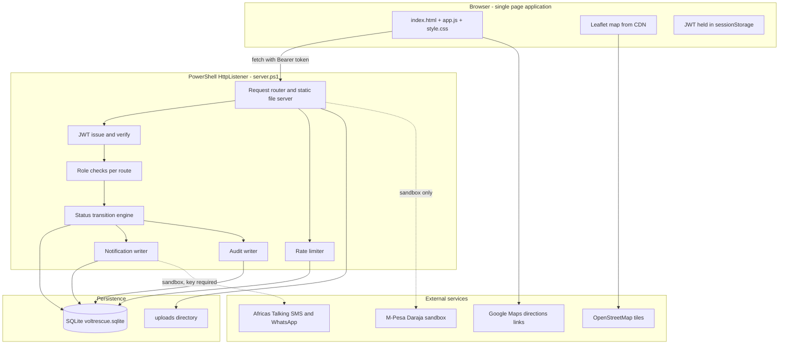
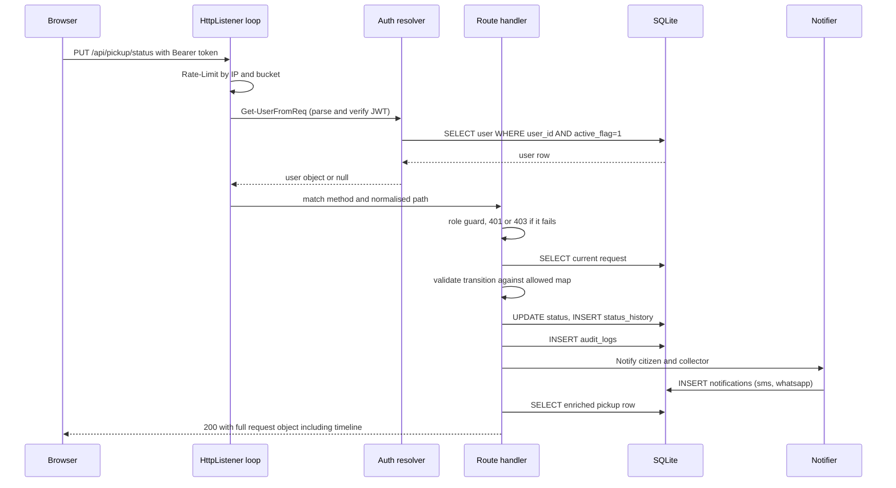
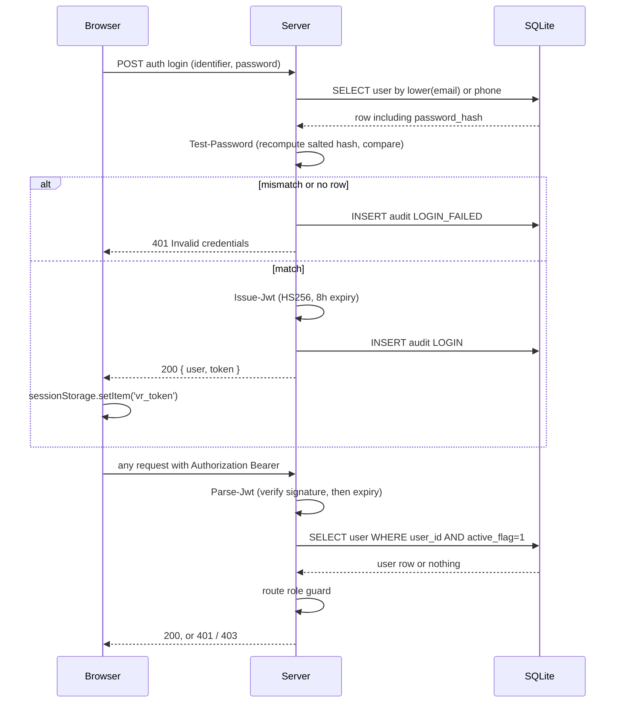
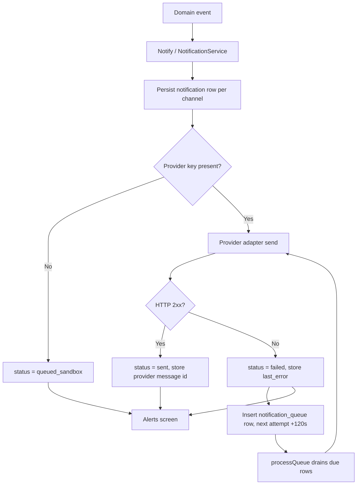
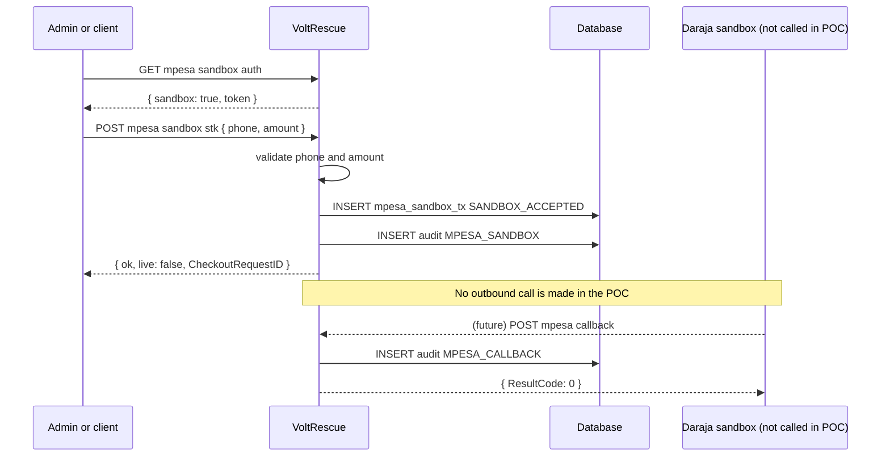

# VoltRescue — Technical Design & Developer Handbook

**Document 3 of 3** · Technical knowledge transfer
**Audience:** Developers, technical support, future maintainers, solution architects
**System version:** VoltRescue POC — Dar es Salaam pilot, Phase 1
**Runtime host:** PowerShell `HttpListener` on `http://127.0.0.1:8815/`
**Datastore:** SQLite, `data/voltrescue.sqlite`
**Last verified test run:** 170 checks executed (42 unit + 128 API), 170 passed, 0 failed
**Companion documents:** `01_VoltRescue_Process_Flow_Guide.md`, `02_VoltRescue_User_Guide.md`

> **Read this first.** There are **two** server implementations in this repository. `server.ps1` (PowerShell) is the one that actually runs and is the subject of every statement in this handbook unless stated otherwise. The PHP tree under `api/` is a complete, functionally equivalent reference implementation that **cannot execute on the pilot machine** because Windows Application Control blocks the unsigned `php.exe`. Section 3 explains which is which, and section 19 covers the consequences.

---

## Table of contents

1. Solution Architecture
2. Technology Stack
3. Repository Structure
4. Source Code Inventory
5. Database Design
6. API Documentation
7. Authentication Design
8. Notification Framework
9. Africa's Talking Integration
10. M-Pesa Integration
11. Geolocation Architecture
12. File Upload Framework
13. Security Design
14. Audit Logging Framework
15. Error Handling Standards
16. Deployment Guide
17. Monitoring & Support
18. Test Strategy
19. Known Limitations
20. Future Enhancements
· Documentation Coverage Report

---

## 1. Solution Architecture

### 1.1 Architectural overview

VoltRescue is a **three-tier application**: a browser single-page application, a stateless HTTP API, and a single-file relational database. There is no framework, no build step, no package manager, and no external runtime dependency beyond PowerShell 5.1 and a bundled `sqlite3.exe`. This was a deliberate constraint — the pilot machine has no Node.js, no working Python, no XAMPP, and blocks unsigned executables.



### 1.2 Tier responsibilities

**Frontend.** A single HTML shell plus one JavaScript file. There is no router library and no virtual DOM; `route()` picks a render function based on a `view` variable and replaces the contents of `#app`. Every render function fetches its own data from the API — the client keeps no cache and no domain state. The only browser-persisted value is the JWT in `sessionStorage`.

**Backend.** `server.ps1` runs a blocking `HttpListener` loop. Each iteration: read the request, serve static assets if the path matches, otherwise normalise the path to an API route, apply the rate limiter, resolve the caller from the `Authorization` header, parse the JSON body, and fall through a linear chain of route guards. Every route explicitly checks role before doing work. All persistence goes through four SQL helpers.

**Database.** SQLite accessed by piping SQL into `tools/sqlite3.exe`. Reads use `-json` and are deserialised into PowerShell objects. There is no ORM and no connection pool — each call is a separate process invocation, which drives one important design rule described in section 4.1.

**External integrations.** All four are optional and degrade safely: without credentials the notification adapters record `queued_sandbox`, the M-Pesa connector returns a synthetic sandbox token, and the map falls back to whatever OpenStreetMap serves.

### 1.3 Request lifecycle



### 1.4 Design principles applied

| Principle | How it is applied |
|---|---|
| Database is the single source of truth | No domain state in the browser; every screen refetches |
| Server-enforced authorisation | Hiding a menu is never the control; every route re-checks role |
| Immutable history | `status_history` and `audit_logs` are append-only |
| Fail safe on integrations | Missing credentials degrade to sandbox, never to a crash |
| No fake success | No screen reports success without a matching database write |
| Zero install | Runs from a folder with a bundled SQLite binary |

---

## 2. Technology Stack

| Layer | Technology | Version / detail | Why it was chosen |
|---|---|---|---|
| Frontend markup | HTML5 | `public/index.html` | No build step required |
| Frontend logic | Vanilla JavaScript (ES2020) | `public/assets/app.js`, ~590 lines | No bundler, no npm available on the host |
| Frontend styling | CSS3 custom properties | `public/assets/style.css` | Dark theme, mobile-first, no framework weight |
| Mapping | Leaflet 1.9.4 | Loaded from unpkg CDN | Lightweight, works with free OSM tiles |
| Map tiles | OpenStreetMap | `tile.openstreetmap.org` | No API key needed for a pilot |
| Navigation links | OpenStreetMap directions + Google Maps directions | URL construction only | Zero integration cost |
| Backend runtime | Windows PowerShell 5.1 | `server.ps1`, ~630 lines | Signed and permitted by Application Control |
| HTTP server | .NET `System.Net.HttpListener` | Bound to `127.0.0.1:8815` | Built into Windows, no install |
| Reference backend | PHP 8 | `api/*.php`, `router.php` | Portable target for a real deployment |
| Database | SQLite 3.46.1 | `data/voltrescue.sqlite` via `tools/sqlite3.exe` | Single file, zero administration |
| Authentication | JWT HS256, hand-rolled | `Issue-Jwt` / `Parse-Jwt` | No JWT library available offline |
| Password storage | Salted SHA-256 (`pbkdf2:salt:hash` envelope) | `Hash-Password` / `Test-Password` | POC-grade; see section 19 |
| SMS provider | Africa's Talking | Sandbox-ready adapter | Preferred vendor for Tanzania |
| WhatsApp provider | Africa's Talking WhatsApp | Adapter reserved, live send disabled | Same vendor, single account |
| Mobile money | Safaricom M-Pesa Daraja | **Sandbox only** | POC requirement, no live debit |
| File storage | Local filesystem | `uploads/{request_id}/` | Simplest durable option |
| Configuration | `.env` key-value file | Loaded by `Load-Env` | Keeps secrets out of source |
| Testing | PowerShell scripts | `tests/unit.ps1` (42) and `tests/run.ps1` (126) | No test framework installable on this host |
| Hosting | Localhost only | Not internet exposed | POC security posture |

---

## 3. Repository Structure

```
VoltRescue/
├── 01_VoltRescue_Process_Flow_Guide.md        Business process documentation
├── 02_VoltRescue_User_Guide.md                End-user manual
├── 03_VoltRescue_Technical_Design_Handbook.md This document
├── .env                                        Live configuration and secrets (git-ignored)
├── .env.example                                Template configuration, safe to commit
├── .gitignore                                  Excludes runtime, database, uploads, .env
├── index.html                                  Redirect stub to the real server address
├── open-docs.html                              Helper page explaining how to open the docs
├── server.ps1                                  ★ THE RUNNING BACKEND — API, static server, domain logic
├── start.ps1                                   Launcher for server.ps1
├── app.js                                      Legacy prototype script — DEAD CODE, not served
├── style.css                                   Legacy prototype styles — DEAD CODE, not served
├── api/                                        PHP reference implementation (does not run on this host)
│   ├── bootstrap.php                           Env loading, PDO, JWT, rate limit, audit, seed
│   ├── Domain.php                              Lifecycle map, pickup projection, M-Pesa sandbox
│   ├── index.php                               PHP REST router, all endpoints
│   ├── NotificationService.php                 Provider interface, SMS/WhatsApp adapters, retry queue
│   └── schema.sql                              ★ CANONICAL DDL — used by both backends
├── public/                                     Everything served to the browser
│   ├── index.html                              SPA shell
│   └── assets/
│       ├── app.js                              ★ THE ENTIRE FRONTEND
│       └── style.css                           Design system and dark theme
├── data/
│   └── voltrescue.sqlite                       ★ THE DATABASE (git-ignored)
├── uploads/                                    Evidence photos, one folder per request (git-ignored)
│   └── .gitkeep
├── tools/
│   └── sqlite3.exe                             Bundled SQLite CLI 3.46.1 — required by server.ps1
├── runtime/
│   └── php/                                    Downloaded PHP — BLOCKED by Application Control
├── tests/
│   ├── unit.ps1                                ★ UNIT SUITE — 42 assertions, no server needed
│   ├── run.ps1                                 ★ END-TO-END API SUITE — 126 assertions
│   └── run.php                                 PHP equivalent, cannot run on this host
├── docs/
│   └── POC_PLATFORM.md                         Condensed architecture and readiness summary
└── router.php                                  PHP front controller (static + API dispatch)
```

### 3.1 Purpose of every folder

| Folder | Purpose | Notes for maintainers |
|---|---|---|
| **repository root** | Entry scripts, configuration, documentation | `server.ps1` is the only backend that executes here |
| **`api/`** | PHP reference implementation | Keep in sync with `server.ps1` **only** if you intend to migrate; otherwise treat as design reference. `schema.sql` inside it **is** live — `server.ps1` reads it at startup |
| **`public/`** | Web root | The only directory `server.ps1` will serve as static content, and only under `/assets/` plus the shell at `/` |
| **`data/`** | SQLite database file | Created automatically. Back this up — it is the entire system state |
| **`uploads/`** | Evidence photos, one subfolder per request ID | Served through a path-traversal-guarded route |
| **`tools/`** | Bundled `sqlite3.exe` | **Required.** `server.ps1` throws at startup if missing |
| **`runtime/`** | Downloaded PHP binaries | Non-functional on this machine; safe to delete |
| **`tests/`** | Automated verification | `run.ps1` is the one that works |
| **`docs/`** | Supplementary technical notes | Summary of this handbook |

---

## 4. Source Code Inventory

### 4.1 `server.ps1` — the running backend

**Location:** repository root · **Size:** ~630 lines · **Language:** Windows PowerShell 5.1

**Purpose.** The complete backend in one file: configuration loading, database access, password hashing, JWT issuing and verification, the lifecycle transition engine, notification writing, audit writing, rate limiting, static file serving, and every API route.

**Dependencies.** `tools/sqlite3.exe`; `api/schema.sql`; `.env` (falls back to `.env.example`); .NET classes `System.Net.HttpListener`, `System.Security.Cryptography.HMACSHA256`, `System.Security.Cryptography.SHA256`.

**Used by.** `start.ps1`; indirectly by `public/assets/app.js` and `tests/run.ps1` over HTTP.

**Internal structure, in file order:**

| Symbol | Kind | Responsibility |
|---|---|---|
| `$Root`, `$Sqlite`, `$Db`, `$Public`, `$Uploads` | Path constants | Resolved relative to the script, so the folder can be moved |
| `Load-Env` | Function | Parses `.env` into a hashtable; falls back to `.env.example` |
| `$JwtSecret`, `$JwtTtl` | Config | Signing secret from env; eight-hour token life |
| `Now-Iso` | Helper | UTC timestamp in `yyyy-MM-ddTHH:mm:ssZ` — the format used everywhere |
| `Q` | Helper | Escapes single quotes for SQL string literals |
| `Invoke-Exec` | Data access | Pipes SQL to sqlite3, discards output |
| `Invoke-Select` | Data access | Pipes SQL with `-json`, parses, **returns `, @($parsed)`** to defeat PowerShell's single-element array unwrapping |
| `Invoke-Scalar` | Data access | Returns the last non-empty output line |
| `Invoke-InsertGetId` | Data access | **Critical.** Appends `SELECT last_insert_rowid();` to the INSERT so both run in **one** sqlite3 process |
| `Sha256`, `Hash-Password`, `Test-Password` | Security | Salted hash envelope `pbkdf2:{salt}:{sha256(salt\|password)}` |
| `B64Url`, `B64UrlStr`, `Issue-Jwt`, `Parse-Jwt` | Security | Hand-rolled HS256 JWT; `Parse-Jwt` verifies signature then expiry |
| `$script:Allowed` | Domain | The status transition map — the authoritative lifecycle definition |
| `Init-Db` | Bootstrap | Applies `api/schema.sql`, seeds five demo users plus collectors and recycler, resets demo passwords |
| `Audit` | Cross-cutting | Writes one `audit_logs` row with JSON detail |
| `Notify` | Cross-cutting | Writes one `notifications` row per channel (sms, whatsapp) |
| `Pickup-Row` | Domain projection | The enriched request object: joins citizen, assignment, collector, latest transfer, recycler; attaches `timeline`, `uploads`, `nav_link`, `google_nav` |
| `Set-Status` | Domain engine | Validates the transition, updates, writes history, audits, notifies, returns the new projection with an HTTP code |
| `Get-UserFromReq` | Security | Bearer token to verified, active user row |
| `Read-Body` | Plumbing | Reads the request stream, stores the raw text in `$script:LastRaw`, parses JSON |
| `Send-Json`, `Send-File` | Plumbing | Response writers with CORS and `no-store` headers |
| `Rate-Limit` | Security | Fixed-window counter per IP and bucket, stored in `rate_limits` |
| listener loop | Entry point | Binds `http://127.0.0.1:8815/`, then dispatches forever |

> **The most important implementation note in this handbook.** Every `sqlite3.exe` call is a **new operating-system process** with its own connection. `SELECT last_insert_rowid()` issued as a separate call therefore always returns `0`. Any code that inserts a row and needs its ID **must** use `Invoke-InsertGetId`, which puts the INSERT and the `last_insert_rowid()` in the same piped script. This defect previously caused pickup creation to return a null request and broke the entire custody chain. If you add a new insert-and-return-ID route, use that helper.

> **Second implementation note.** PowerShell unwraps single-element arrays returned from functions. `Invoke-Select` returns `, @($parsed)` and callers wrap results in `@(...)` before checking `.Count`. Removing either half reintroduces a class of bug where one matching row behaves as if none matched.

### 4.2 `start.ps1`

**Location:** root · **Purpose:** launcher. Sets the working directory to the script's folder, prints the URL, and invokes `server.ps1` with `-NoProfile -ExecutionPolicy Bypass`.
**Dependencies:** `server.ps1`. **Used by:** operators and the user guide.
**Maintenance:** the URL it prints is hard-coded — update it whenever the listener prefix changes.

### 4.3 `public/index.html`

**Location:** `public/` · **Purpose:** the SPA shell. Declares the viewport, loads the Leaflet CSS and JS from unpkg, loads `style.css` and `app.js`, and provides `<div id="app">` plus a skip-to-content link for accessibility.
**Dependencies:** Leaflet CDN, `/assets/style.css`, `/assets/app.js`.
**Used by:** `server.ps1` route `/`.
**Note:** the Leaflet CDN reference is the only external runtime dependency of the frontend; the map degrades to a blank panel offline while the rest of the form still works.

### 4.4 `public/assets/app.js`

**Location:** `public/assets/` · **Size:** ~590 lines · **Purpose:** the entire frontend — authentication screens, all role dashboards, the map, the timeline, uploads, and the admin tooling.

**Dependencies:** the REST API under `/api`; Leaflet global `L`; browser `fetch`, `FormData`, `sessionStorage`, `navigator.geolocation`.
**Used by:** `public/index.html`.

| Symbol | Kind | Responsibility |
|---|---|---|
| `FLOW` | Constant | The twelve success statuses, in order — drives the progress bar |
| `COLLECTOR_NEXT` | Constant | Maps a collector's current status to the single next action offered |
| `token`, `me`, `view` | Module state | JWT, current user, current screen |
| `toast` | UI | Transient bottom notification |
| `api(path, opts)` | Transport | Adds the Bearer header and JSON content type, parses the response, throws `data.error` on non-2xx — this is why UI error messages match server messages exactly |
| `progressHtml` | UI | Twelve-segment lifecycle bar |
| `layout(body)` | UI | Renders the role-aware top bar and wires navigation and logout |
| `renderAuth(mode)` | Screen | Login, register, and reset in one component with three modes |
| `bindMap(latEl, lngEl)` | Feature | Initialises Leaflet over Dar es Salaam, wires click, drag, and the geolocation button into hidden lat/lng inputs |
| `viewRequest` | Screen | Pickup request form; posts to pickup create, then switches to tracking |
| `card(p, extra)` | UI | The shared request card used by every role |
| `viewTrack` | Screen | Citizen's own requests with empty and error states |
| `openDetail(id)` | Screen | Timeline, evidence previews, and the upload form for non-citizens; converts the file to base64 before posting |
| `viewCollector` | Screen | Assignments with accept, next-status, no-show, and the recycler transfer form |
| `viewRecycler` | Screen | Incoming loads with receive, reject, validate, complete |
| `viewAdmin` | Screen | KPIs, search and filter, paginated table, assign and override controls, user creation, audit link, CSV export, M-Pesa check |
| `viewInbox` | Screen | The notification list |
| `viewProfile` | Screen | Name and email editing |
| `route`, `boot` | Control | Screen dispatch; on load, restores a session by calling auth me and discards an invalid token |

**Maintenance notes.** Screens re-render by replacing `innerHTML` and rebinding handlers — there is no event delegation, so any new control must be wired inside the same function that renders it. Adding a status means updating `FLOW`, and `COLLECTOR_NEXT` if a collector drives it.

### 4.5 `public/assets/style.css`

**Location:** `public/assets/` · **Purpose:** the design system. CSS custom properties define the dark palette (`--bg`, `--panel`, `--line`, `--text`, `--muted`, `--accent`, `--ok`, `--warn`, `--bad`), radius, and font stack. Provides the top bar, pill buttons, cards, grid, progress bar, timeline, tables, KPI tiles, toasts, image previews, form controls, and the focusable skip link.
**Used by:** `public/index.html`. **Dependencies:** none.

### 4.6 `api/schema.sql`

**Location:** `api/` · **Purpose:** the canonical DDL for all thirteen tables plus four indexes. Written with `CREATE TABLE IF NOT EXISTS` so it is safe to re-apply on every startup.
**Used by:** `server.ps1` (`Init-Db` reads it with `.read`) **and** `api/bootstrap.php`.
**Maintenance:** this file is shared by both backends. Because it uses `IF NOT EXISTS`, it does not perform migrations — altering an existing column requires a hand-written migration against the live database file.

### 4.7 `api/bootstrap.php` *(reference implementation)*

**Purpose:** PHP infrastructure — `.env` loading, JSON responses, a PDO SQLite singleton that applies the schema and seeds, base64url helpers, `jwt_issue` / `jwt_verify`, `bearer_token`, `current_user`, `require_user($roles)`, `rate_limit`, `audit`, `seed_if_empty`.
**Notable difference from the PowerShell host:** it uses `password_hash` / `PASSWORD_DEFAULT` (bcrypt), which is stronger than the PowerShell salted-SHA-256 envelope, and PDO prepared statements throughout. Both are things a production migration should adopt.

### 4.8 `api/Domain.php` *(reference implementation)*

**Purpose:** the domain layer — `SUCCESS_FLOW`, `FAILURE_STATES`, the `ALLOWED` transition map, `pickup_row()` projection, `set_status()` engine, and the `MpesaSandbox` class (`authenticate`, `validateStk`, `stkPush`).
**Parity note:** the `ALLOWED` map here and `$script:Allowed` in `server.ps1` are identical. If you change one, change both, or the two backends will disagree about legality.

### 4.9 `api/NotificationService.php` *(reference implementation)*

**Purpose:** the notification architecture the PowerShell host models but does not fully implement.

| Symbol | Responsibility |
|---|---|
| `NotificationProvider` | Interface: `channel()` and `send($recipient, $message, $meta)` |
| `SmsAdapter` | Africa's Talking messaging endpoint via cURL; returns `queued_sandbox` when no key is set |
| `WhatsAppAdapter` | Parallel channel; live send deliberately disabled, endpoint reserved |
| `NotificationService::notify` | Persists first, then attempts each channel, then drains the queue |
| `NotificationService::persist` | Inserts the `notifications` row and returns its ID |
| `NotificationService::attempt` | Updates status, delivery status, provider message ID, attempt count, and last error; on failure enqueues a retry two minutes out |
| `NotificationService::processQueue` | Drains due `notification_queue` rows, retries, marks done |
| `notify_user()` | Convenience wrapper used by the domain layer |

**Gap to be aware of:** `server.ps1`'s `Notify` writes the same `notifications` rows but has **no retry queue and no live HTTP send**. The queue table exists and is unused by the running host. Closing that gap is the first Phase 2 backend task.

### 4.10 `api/index.php` *(reference implementation)*

**Purpose:** the PHP REST router. Sets CORS, answers preflight, normalises the URI, applies the global rate limit, and dispatches the same endpoint set as `server.ps1` using `require_user()` for role enforcement.
**Dependencies:** `bootstrap.php`, `NotificationService.php`, `Domain.php`.

### 4.11 `router.php` *(reference implementation)*

**Purpose:** PHP front controller for `php -S`. Routes `/api` to `api/index.php`, serves `/uploads/` with a `realpath` traversal guard and MIME detection, serves files from `public/`, and falls back to the SPA shell.

### 4.12 `tests/unit.ps1` and `tests/run.ps1`

**`tests/unit.ps1`** — **Location:** `tests/` · **Purpose:** 42 unit assertions over SQL quoting, CSV encoding, password hashing, JWT issue and verification, the lifecycle map, and the notification adapters.
**Dependencies:** none beyond `server.ps1`, which it dot-sources with `-LibraryOnly` so no port is bound and no server is needed.

**`tests/run.ps1`** — **Location:** `tests/` · **Purpose:** the end-to-end API suite. 126 assertions in eleven labelled phases covering smoke and authentication, validation, RBAC, the full lifecycle, uploads and ownership, failure paths and recovery, transition rules, notifications, admin surfaces, sandbox connectors, and database persistence.
**Dependencies:** a running server; `System.Web.Extensions` for `JavaScriptSerializer`; `tools/sqlite3.exe` for direct database assertions. Reads `APP_PORT` from `.env` so it follows the server automatically, and clears `rate_limits` between phases so a thorough run does not trip the limiter.
**Used by:** developers and CI-by-hand.

| Helper | Responsibility |
|---|---|
| `First-Int($v)` | Takes the first element and casts to int — guards against PowerShell array quirks |
| `Req($method, $path, $body, $token)` | Issues the call, attaches the Bearer token, serialises with `JavaScriptSerializer` (**not** `ConvertTo-Json`, which escapes `!` as `\u0021` and broke password comparison), and unwraps error responses |
| `Check($name, $ok, $detail)` | Records pass or fail and prints the line |

**Maintenance:** the base URL is hard-coded at line 1 — update it with the listener prefix.

### 4.13 `tests/run.php` *(reference implementation)*

PHP equivalent of the suite. Cannot execute on the pilot machine.

### 4.14 Configuration files

| File | Purpose |
|---|---|
| `.env` | Live configuration including secrets. **Git-ignored.** Read first by `Load-Env` |
| `.env.example` | Committed template with empty secret values — the documented key list |
| `.gitignore` | Excludes `runtime/`, `data/*.sqlite`, `uploads/*` (except `.gitkeep`), `.env`, and `*.log` |

### 4.15 Root helper and legacy files

| File | Status | Notes |
|---|---|---|
| `index.html` | Active signpost | A static page telling the reader to run `start.ps1` and giving the default address. Opening it via `file://` cannot run the app — it exists to stop people trying |
| `open-docs.html` | Active helper | Explains that the three Markdown guides exist and why a preview pane may fail to render them |
| `runtime/php/` | **Non-functional** | Blocked by Application Control |

Root-level `app.js` and `style.css` (the original localStorage prototype) have been **deleted**. Nothing served referenced them, and two divergent copies of the frontend in one tree is a trap.

---

## 4.16 Language pitfalls that have already caused bugs

Anyone maintaining `server.ps1` needs these four facts. Each corresponds to a defect that reached a running build.

**1. `return ,@(...)` and `@(...)` at the call site must never be combined.**

This is the most damaging bug the project has had. PowerShell unrolls the outermost array when a function returns, so the comma idiom is used to force "always an array". But if the caller *also* wraps the call in `@(...)`, the result nests:

```powershell
function f { return ,@(1,2,3) }
@(f).Count    # 1  <- the array became a single element
(f).Count     # 3
```

`Invoke-Select` used the comma while most call sites used `@()`. The effect was that **every API list containing two or more rows collapsed to one nested element**: twelve-stage timelines rendered as one entry, the collectors list returned only index 0, and dashboard tables silently truncated. The rule now is: **`Invoke-Select` returns rows unrolled, and every call site wraps in `@()`.** There is a comment on the function saying so.

**2. A single `PSCustomObject` does not expose `.Count`.**

PowerShell adds `Count` to most scalars, but an object from `ConvertFrom-Json` returns `$null` for `.Count`. Code like `if ($rows.Count) { ... }` therefore evaluates false for a one-row result, which is how authentication broke: `Get-UserFromReq` found the user and then discarded it. Indexing (`$rows[0]`) does work on a scalar. Always use `@(...)` before testing `.Count`.

**3. `sqlite3.exe` reports failures on stderr and keeps going.**

A failed `INSERT` does not raise a PowerShell error, and the following `SELECT last_insert_rowid();` still runs — returning `0`. Silent corruption follows. `Test-SqliteError` now inspects the output for the CLI's error wording, `Invoke-Exec`/`Invoke-Scalar` throw on it, and `Invoke-InsertGetId` refuses any id that is not a positive integer. That is what makes duplicate registration return a clean 409.

Note also that the error detection must not simply search for the word "error": the `notifications` table has a **`last_error`** column, so `SELECT *` output contains that string on every successful read. An earlier version discarded every notification row for exactly this reason.

**4. `$host` is a reserved automatic variable.**

Assigning to it throws at parse-scope. The Africa's Talking adapter uses `$apiHost`.

---

## 5. Database Design

### 5.1 ER diagram

```mermaid
erDiagram
    USERS ||--o| COLLECTORS : "is a"
    USERS ||--o| RECYCLERS : "is a"
    USERS ||--o{ PICKUP_REQUESTS : "raises"
    USERS ||--o{ NOTIFICATIONS : "receives"
    USERS ||--o{ AUDIT_LOGS : "acts in"
    USERS ||--o{ STATUS_HISTORY : "updates"
    USERS ||--o{ UPLOADS : "uploads"
    PICKUP_REQUESTS ||--o| ASSIGNMENTS : "has one"
    COLLECTORS ||--o{ ASSIGNMENTS : "receives"
    PICKUP_REQUESTS ||--o{ CUSTODY_TRANSFERS : "has"
    COLLECTORS ||--o{ CUSTODY_TRANSFERS : "hands over"
    RECYCLERS ||--o{ CUSTODY_TRANSFERS : "accepts"
    PICKUP_REQUESTS ||--o{ STATUS_HISTORY : "logs"
    PICKUP_REQUESTS ||--o{ UPLOADS : "evidences"
    PICKUP_REQUESTS ||--o{ MPESA_SANDBOX_TX : "may reference"
    NOTIFICATIONS ||--o{ NOTIFICATION_QUEUE : "retries via"

    USERS {
        int user_id PK
        text name
        text phone UK
        text email UK
        text role
        text password_hash
        text reset_token
        text reset_expires_at
        int active_flag
        text created_at
    }
    COLLECTORS {
        int collector_id PK
        int user_id FK-UK
        text name
        text phone
        text vehicle
        text area
        int active_flag
    }
    RECYCLERS {
        int recycler_id PK
        int user_id FK-UK
        text company_name
        text location
        text contact_person
        text phone
    }
    PICKUP_REQUESTS {
        int request_id PK
        int user_id FK
        text location
        text area
        real latitude
        real longitude
        text battery_type
        int quantity
        text remarks
        text status
        text created_at
        text updated_at
    }
    ASSIGNMENTS {
        int assignment_id PK
        int request_id FK-UK
        int collector_id FK
        text assigned_at
        int assigned_by FK
        text accepted_at
    }
    CUSTODY_TRANSFERS {
        int transfer_id PK
        int request_id FK
        int collector_id FK
        int recycler_id FK
        text status
        text transfer_date
        text notes
    }
    STATUS_HISTORY {
        int history_id PK
        int request_id FK
        text old_status
        text new_status
        int updated_by FK
        text updated_time
        text note
    }
    NOTIFICATIONS {
        int notification_id PK
        text recipient
        int user_id
        text channel
        text status
        text message
        text provider
        text provider_message_id
        text delivery_status
        int attempts
        text last_error
        text created_at
    }
    AUDIT_LOGS {
        int log_id PK
        text action
        int actor
        text entity
        text entity_id
        text detail
        text timestamp
    }
    UPLOADS {
        int upload_id PK
        int request_id FK
        text kind
        text file_path
        text mime_type
        int uploader FK
        text created_at
    }
    NOTIFICATION_QUEUE {
        int queue_id PK
        int notification_id FK
        text payload
        text next_attempt_at
        int done
    }
    MPESA_SANDBOX_TX {
        int tx_id PK
        int request_id
        real amount
        text phone
        text status
        text checkout_id
        text result
        text created_at
    }
    RATE_LIMITS {
        text key PK
        int hits
        int window_start
    }
```

### 5.2 Table reference

**`users`** — every human in the system, all four roles.

| Column | Type | Constraints | Notes |
|---|---|---|---|
| `user_id` | INTEGER | PK AUTOINCREMENT | |
| `name` | TEXT | NOT NULL | Person or business name |
| `phone` | TEXT | NOT NULL UNIQUE | Format `255XXXXXXXXX`, enforced in the API |
| `email` | TEXT | NOT NULL UNIQUE | Stored lower-case |
| `role` | TEXT | NOT NULL, CHECK in (citizen, collector, recycler, admin) | Database-level role integrity |
| `password_hash` | TEXT | NOT NULL | `pbkdf2:{salt}:{sha256}` from PowerShell; bcrypt from PHP |
| `reset_token` | TEXT | nullable | Single-use reset code |
| `reset_expires_at` | TEXT | nullable | ISO 8601 UTC, 30-minute life |
| `active_flag` | INTEGER | NOT NULL DEFAULT 1 | `0` blocks login and invalidates existing tokens |
| `created_at` | TEXT | NOT NULL | ISO 8601 UTC |

**`collectors`** — field agent profile. `user_id` is **UNIQUE**, so one user is at most one collector. Holds `vehicle` and `area` for dispatch, and `active_flag` for availability.

**`recyclers`** — partner company profile. `user_id` is **UNIQUE**. Holds `company_name`, `location`, `contact_person`, `phone`.

**`pickup_requests`** — the central entity. `latitude` and `longitude` are `REAL` and nullable. `status` is free text validated by the application against the transition map — deliberately not a `CHECK` constraint, so an admin override or a future status does not require a schema migration. `created_at` and `updated_at` are both maintained.

**`assignments`** — `request_id` is **UNIQUE**, enforcing one active assignment per request; reassignment updates the row rather than inserting. `assigned_by` records the administrator, `accepted_at` is null until the collector accepts.

**`custody_transfers`** — one row per handover attempt, so a rejected or failed transfer leaves a permanent record and a new attempt appends another row. `Pickup-Row` always projects the **latest** transfer by `transfer_id`.

**`status_history`** — the append-only timeline. `old_status` is null for the creation event. `updated_by` names the actor; `note` carries the reason.

**`notifications`** — one row per channel per event, with `provider`, `provider_message_id`, `delivery_status`, `attempts`, and `last_error` for delivery forensics.

**`audit_logs`** — append-only action log. `detail` holds compact JSON, `entity_id` is TEXT so it can reference non-integer keys such as a phone number.

**`uploads`** — evidence metadata. `file_path` is a repository-relative path such as `uploads/12/pickup_1757...jpg`; the bytes live on disk.

**`notification_queue`** — retry scheduling. Written by the PHP notification service; **currently unused by the running PowerShell host**.

**`mpesa_sandbox_tx`** — sandbox transaction log. `result` stores the raw JSON response. `request_id` is intentionally **not** a foreign key, so a standalone sandbox test needs no pickup.

**`rate_limits`** — fixed-window counters keyed `"{bucket}:{ip}"`.

### 5.3 Relationships, constraints, and indexes

**Foreign keys.** `PRAGMA foreign_keys = ON` is declared in the schema. Declared relationships: collectors and recyclers to users; pickup requests to users; assignments to requests, collectors, and users; custody transfers to requests, collectors, and recyclers; status history to requests and users; uploads to requests and users; notification queue to notifications.

**Uniqueness.** `users.phone`, `users.email`, `collectors.user_id`, `recyclers.user_id`, `assignments.request_id`, `rate_limits.key`.

**Check constraints.** `users.role` is restricted to the four role names.

**Indexes.**

| Index | Column | Serves |
|---|---|---|
| `idx_pickup_status` | `pickup_requests(status)` | Dashboard KPI counters and status filtering |
| `idx_pickup_user` | `pickup_requests(user_id)` | The citizen's own-requests list |
| `idx_history_request` | `status_history(request_id)` | Timeline retrieval |
| `idx_notif_recipient` | `notifications(recipient)` | The Alerts screen |

### 5.4 Seed data

`Init-Db` seeds only when `users` is empty: five accounts (`citizen@`, `collector@`, `neema.collector@`, `recycler@`, `admin@voltrescue.local`), two collector profiles (Juma with Bajaj TR-01 in Kariakoo, Neema with Van TM-19 in Kinondoni), and one recycler (GreenCycle Dar, Vingunguti Industrial Area).

On **every** startup it then re-hashes the demo password `VoltRescue!23` for all `@voltrescue.local` accounts. This keeps the pilot demo reliable and **must be removed before any real deployment** — see section 19.

---

## 6. API Documentation

### 6.1 Conventions

**Base URL:** `http://127.0.0.1:8815/api` — the `/api` prefix is stripped internally, so `/api/health` and `/health` both resolve.
**Content type:** `application/json; charset=utf-8` for both directions, except the CSV export.
**Authentication:** `Authorization: Bearer <jwt>`.
**CORS:** `Access-Control-Allow-Origin: *`, preflight answered with 204. Acceptable only because the listener is bound to loopback.
**Caching:** every JSON response sends `Cache-Control: no-store`.

**Status codes used across the API**

| Code | Meaning |
|---|---|
| 200 | Success |
| 201 | Created (register, pickup create, admin user create, upload) |
| 204 | Preflight |
| 401 | No token, invalid token, expired token, or inactive user |
| 403 | Authenticated but the role or ownership check failed |
| 404 | Record or route not found |
| 409 | Illegal status transition, or duplicate registration |
| 422 | Validation failure |
| 429 | Rate limit exceeded |
| 500 | Unhandled server error (audited, message returned in `detail`) |

**Global rate limits:** 120 requests per minute per IP on the whole API; 200 per minute on login; 10 per five minutes on registration.

### 6.2 Endpoint reference

---

#### `GET /health`
**Security:** public.
**Response 200:** `{ ok, service, time, store, users, probe }` — `users` is the account count, `probe` proves the SQLite read path works.

---

#### `GET /meta/lifecycle`
**Security:** public.
**Response 200:** `{ success: [12 statuses], failures: [5 statuses], allowed: {…transition map} }`. Lets a client discover the lifecycle instead of hard-coding it.

---

#### `POST /auth/register`
**Security:** public; rate limited 10 per 300 s.
**Request:** `{ name, phone, email, password, role?, vehicle?, area?, company_name?, location? }`
**Rules:** all four core fields required; phone `^255\d{9}$`; password ≥ 8; role coerced to `citizen` unless it is `collector` or `recycler`. A collector or recycler profile row is created automatically.
**Response 201:** `{ user, token }`.
**Errors:** 422 validation, 409 duplicate phone or email, 429.

---

#### `POST /auth/login`
**Security:** public; rate limited 200 per 60 s.
**Request:** `{ identifier | email | phone, password }`
**Behaviour:** looks up by lower-cased email or exact phone, then verifies the stored hash. Writes `LOGIN` or `LOGIN_FAILED` to the audit log.
**Response 200:** `{ user, token }`.
**Errors:** 401 invalid credentials (deliberately identical for unknown user and wrong password), 422 missing fields, 429.

---

#### `GET /auth/me`
**Security:** any authenticated user. **Response 200:** `{ user }`. **Errors:** 401. Used by `boot()` to restore a session.

---

#### `PUT /auth/me`
**Security:** any authenticated user. **Request:** `{ name?, email? }`. Role and phone are not editable here.
**Response 200:** `{ ok: true }`. Audits `PROFILE_UPDATE`. **Errors:** 401.

---

#### `POST /auth/password-reset`
**Security:** public. **Request:** `{ phone }`.
**Behaviour:** if the phone exists, generates a 40-character token with a 30-minute expiry and notifies the user. **Always** responds 200 with a neutral message, so the endpoint cannot be used to enumerate accounts.

---

#### `POST /auth/password-reset/confirm`
**Security:** public. **Request:** `{ token, password }`.
**Behaviour:** matches an unexpired token, re-hashes the password, clears the token. Audits `PASSWORD_RESET`.
**Response 200:** `{ ok: true }`. **Errors:** 422 invalid or expired token, or password shorter than eight characters.

---

#### `POST /pickup/create`
**Security:** `citizen` or `admin`.
**Request:** `{ location, battery_type, quantity, area?, latitude?, longitude?, remarks?, user_id? }` — `user_id` is honoured only for admins raising a request on someone's behalf.
**Behaviour:** inserts via `Invoke-InsertGetId`, writes the `REQUEST_SUBMITTED` history row, audits `PICKUP_CREATE`, advances to `PENDING_ASSIGNMENT`, notifies the citizen and **every active admin**.
**Response 201:** `{ request }` — the full projection including `timeline`, `uploads`, and navigation links.
**Errors:** 401, 403, 422 (`location, battery_type and quantity (>=1) are required`).

---

#### `GET /pickup`
**Security:** any authenticated user; **results are scoped by role** in SQL: citizens see their own rows, collectors see rows joined through their assignments, recyclers see rows joined through custody transfers, admins see everything. Ordered by request ID descending.
**Response 200:** `{ items: [...] }`.

---

#### `GET /pickup/{id}`
**Security:** authenticated; a citizen requesting another citizen's request receives 403.
**Response 200:** `{ request }` with `timeline`, `uploads`, `nav_link`, `google_nav`.
**Errors:** 401, 403, 404.

---

#### `PUT /pickup/status`
**Security:** authenticated; `override` is honoured only for admins.
**Request:** `{ request_id, status, note?, override? }`
**Behaviour:** delegates to `Set-Status`, which validates against the transition map, updates the request, appends history, audits `STATUS_CHANGE`, and notifies the citizen and collector.
**Response 200:** `{ request }`.
**Errors:** 401, 404 `Request not found`, 409 `Illegal transition X -> Y` with the `allowed` array, 422 missing fields.

---

#### `GET /recyclers`
**Security:** `collector`, `recycler`, or `admin`. **Response 200:** `{ items }` — populates the handover dropdown.

---

#### `GET /collector/tasks`
**Security:** `collector` or `admin`. Collectors see only their own assignments; admins see all. Ordered by last update.
**Response 200:** `{ items }` including `assignment_id`, `accepted_at`, and collector identity.

---

#### `POST /collector/accept`
**Security:** `collector` only. **Request:** `{ request_id }`.
**Behaviour:** verifies the collector profile exists and that the assignment belongs to this collector, stamps `accepted_at`, transitions to `PICKUP_ACCEPTED`.
**Errors:** 401, 403 `Not assigned to this collector` / `Collector profile missing`, 409 if the current status does not allow acceptance.

---

#### `POST /collector/handover`
**Security:** `collector` only. **Request:** `{ request_id, recycler_id, notes? }`.
**Behaviour:** confirms the caller currently holds the request; if the status is `IN_COLLECTOR_CUSTODY` it first moves to `TRANSFER_SCHEDULED`; inserts the `custody_transfers` row; advances to `IN_TRANSIT_TO_RECYCLER`; notifies the recycler.
**Response 200:** `{ request }`. **Errors:** 401, 403 `Collector does not hold this request`, 422 missing fields.

---

#### `POST /recycler/confirm`
**Security:** `recycler` or `admin`. **Request:** `{ request_id, action, note? }` where `action` is `receive`, `validate`, `reject`, or `complete`.
**Mapping:** `receive` → `RECEIVED_BY_RECYCLER`, `validate` → `RECYCLER_VALIDATED`, `reject` → `RECYCLER_REJECTED`, `complete` → `PROCESS_COMPLETED` (inserting the validation step automatically if the request is still merely received).
**Side effect:** synchronises `custody_transfers.status` with the new request status.
**Errors:** 401, 403, 404, 409.

---

#### `GET /admin/dashboard`
**Security:** `admin`. **Query:** `q`, `status`, `page`, `sort`, `dir`.
**Response 200:** `{ kpis: { today, pending_assignment, assigned, recycler_pending, completed, failed }, workload: [{ name, jobs }], items: [...], page, size, total }`. Page size is fixed at ten; search matches location, citizen name, or battery type.

---

#### `GET /admin/export`
**Security:** `admin`. **Response 200:** `text/csv` as an attachment named `voltrescue-requests.csv` with columns request_id, citizen, location, battery_type, quantity, status, created_at.
**Known limitation:** fields are not quoted, so a comma inside an address will shift columns. Fix before relying on this for formal reporting.

---

#### `POST /admin/assign`
**Security:** `admin`. **Request:** `{ request_id, collector_id }`.
**Behaviour:** updates the existing assignment or inserts a new one, clearing `accepted_at` on reassignment; transitions to `COLLECTOR_ASSIGNED` (using an override when the request is beyond the normal assignment point); notifies the collector by name and location.
**Errors:** 401, 403, 404 `Request not found`.

---

#### `GET /admin/users`
**Security:** `admin`. **Response 200:** `{ users, collectors, recyclers }`. Password hashes are never included.

---

#### `POST /admin/users`
**Security:** `admin`. **Request:** `{ name, phone, email, role, password?, vehicle?, area?, company_name?, location?, contact_person? }`. Password defaults to `VoltRescue!23` when omitted. Creates the collector or recycler profile as appropriate. Audits `USER_CREATE`.
**Response 201:** `{ user_id }`.

---

#### `GET /audit/logs`
**Security:** `admin`. **Query:** `page` (25 per page). **Response 200:** `{ items, page }` — newest first, joined to the actor's name.

---

#### `GET /notifications`
**Security:** authenticated. Returns the caller's 50 most recent messages, matched by `user_id` **or** recipient phone.
**Response 200:** `{ items }` — each item carries `channel`, `status`, `delivery_status`, `provider`, `provider_message_id`, `attempts` and `last_error`.

---

#### `GET /notifications/stats`
**Security:** admin only.
**Response 200:** `{ by_channel, queue_pending, max_attempts, live_provider }`. `by_channel` groups counts by channel and status; `live_provider` is `false` whenever no Africa's Talking key is configured, which is the honest signal that nothing has actually been sent.

---

#### `POST /notifications/process`
**Security:** admin only. Drains up to 25 due rows from `notification_queue`, applying exponential backoff and retiring anything past `NotifyMaxAttempts` as `failed_permanent`. Audits `NOTIFY_QUEUE_RUN`.
**Response 200:** `{ processed, pending }`.

---

#### `POST /notifications/delivery`
**Security:** **unauthenticated** — this is the provider callback for Africa's Talking delivery reports, and providers cannot present a bearer token. See L-12b: verify the provider signature before exposing this host publicly.
**Request:** `{ id | messageId, status }`.
**Behaviour:** matches on `provider_message_id` and updates `delivery_status`; audits `NOTIFY_DELIVERY_REPORT`.
**Response 200:** `{ ok: true }` — always, so a provider is never encouraged to retry a report.

---

#### `POST /admin/shutdown`
**Security:** admin only. Stops the `HttpListener` cleanly and exits the request loop, which releases the HTTP.sys prefix. Use this rather than killing the process; see the deployment note in §16 on stranded ports. Audits `SHUTDOWN`.
**Response 200:** `{ ok: true, message }`, sent before the listener stops.

---

#### `POST /uploads`
**Security:** authenticated **and ownership-checked**. `Test-UploadRight` permits the admin, the collector assigned to this request, and the recycler receiving it. Citizens are refused — evidence is a chain-of-custody artefact, not a user attachment.
**Request:** `{ request_id, kind, mime, data }` where `data` is base64 (no data-URL prefix).
**Behaviour:** decodes, enforces a 5 MB limit, picks the extension from the MIME type (jpg default, png, webp), writes to `uploads/{request_id}/{kind}_{epoch}_{random}.{ext}`, records the metadata, audits `UPLOAD`.
**Response 201:** `{ file_path, kind, created_at }`. **Errors:** 401 unauthenticated, 403 not permitted for this request, 404 unknown request, 422 missing fields or `Max 5MB`.

---

#### `GET /mpesa/sandbox/auth`
**Security:** `admin`. **Response 200:** `{ ok, sandbox: true, token, note }` — a synthetic token. No outbound call is made from the PowerShell host.

---

#### `POST /mpesa/sandbox/stk`
**Security:** authenticated. **Request:** `{ phone, amount, request_id? }`.
**Validation:** phone `^255\d{9}$`, amount greater than zero.
**Behaviour:** generates a `ws_POC_…` checkout ID, records the row with status `SANDBOX_ACCEPTED` and `{"live":false}`, audits `MPESA_SANDBOX`.
**Response 200:** `{ ok, live: false, CheckoutRequestID, CustomerMessage }`. **Errors:** 401, 422 with an `errors` array.

---

#### `POST /mpesa/callback`
**Security:** public — this is the shape a real Daraja callback would take.
**Behaviour:** audits `MPESA_CALLBACK` with the raw body and returns `{ ResultCode: 0 }`.
**Production warning:** before exposing this publicly, add source validation and signature checking.

---

### 6.3 Static and file routes

| Route | Behaviour |
|---|---|
| `GET /` and `/index.html` | Serves `public/index.html` |
| `GET /assets/*` | Serves `public/assets/*` with JS and CSS MIME types |
| `GET /uploads/*` | Serves evidence files **after** resolving the real path and confirming it is inside the uploads root — this is the path-traversal guard |
| `OPTIONS *` | 204 with CORS headers |
| Unmatched under `/api` | 404 `{ error: 'Unknown API route', path, method }` |

---

## 7. Authentication Design

### 7.1 JWT flow



**Token structure.** Header `{"typ":"JWT","alg":"HS256"}`. Payload `{ sub, role, name, iat, exp }`. Signature `HMACSHA256(header.payload, JWT_SECRET)`, all segments base64url without padding.

**Verification order matters.** `Parse-Jwt` recomputes the signature and rejects a mismatch **before** decoding the payload, so a forged payload is never trusted. It then rejects an expired `exp`.

**Freshness over convenience.** The `role` claim inside the token is **not** trusted for authorisation. Every request re-reads the user row from the database, so deactivating an account or changing a role takes effect on the next request rather than in eight hours' time.

**Session handling.** The token lives in `sessionStorage`, which is cleared when the tab closes and is not shared across tabs. There is no refresh token and no server-side session table; the server is fully stateless with respect to sessions. Logout clears the token client-side.

**A known implementation caveat.** `Parse-Jwt` compares the computed signature with `-ne`, an ordinary string comparison rather than a constant-time one. In a loopback POC this is acceptable; a production port should use a fixed-time comparison, as the PHP reference already does with `hash_equals`.

### 7.2 Roles and permissions

| Endpoint | citizen | collector | recycler | admin |
|---|:--:|:--:|:--:|:--:|
| `POST /auth/register`, `/auth/login`, reset endpoints | public | public | public | public |
| `GET`/`PUT /auth/me`, `GET /notifications` | ✅ | ✅ | ✅ | ✅ |
| `POST /uploads` | ❌ | assigned only | receiving only | ✅ |
| `POST /notifications/delivery` | public (provider callback) | | | |
| `GET /notifications/stats`, `POST /notifications/process`, `POST /admin/shutdown` | ❌ | ❌ | ❌ | ✅ |
| `POST /pickup/create` | ✅ | ❌ | ❌ | ✅ |
| `GET /pickup`, `GET /pickup/{id}` | own only | assigned only | transfers only | all |
| `PUT /pickup/status` | ✅ (legal transitions) | ✅ | ✅ | ✅ + override |
| `GET /recyclers` | ❌ | ✅ | ✅ | ✅ |
| `GET /collector/tasks` | ❌ | own | ❌ | all |
| `POST /collector/accept`, `/collector/handover` | ❌ | ✅ | ❌ | ❌ |
| `POST /recycler/confirm` | ❌ | ❌ | ✅ | ✅ |
| `GET /admin/dashboard`, `/admin/export`, `/admin/users`, `POST /admin/assign`, `/admin/users`, `GET /audit/logs`, `GET /mpesa/sandbox/auth` | ❌ | ❌ | ❌ | ✅ |
| `POST /mpesa/sandbox/stk` | ✅ | ✅ | ✅ | ✅ |

Two enforcement layers operate together: **role checks** (`$user.role -ne 'admin'` and equivalents) and **ownership checks** (a citizen's `user_id` must match the request; a collector's `collector_id` must match the assignment). Row scoping is additionally pushed into the SQL of list endpoints, so an unauthorised row is never even selected.

### 7.3 Password encryption

`Hash-Password` generates a GUID salt and stores `pbkdf2:{salt}:{sha256(salt + "|" + password)}`. `Test-Password` parses the envelope, recomputes, and compares.

**Be honest about this in any review:** despite the `pbkdf2:` prefix, this is a **single-round salted SHA-256**, not PBKDF2 and not a memory-hard function. It defeats rainbow tables and it is fast, which is exactly the wrong trade-off against offline brute force. It is acceptable only because the database never leaves a local machine in this POC. The PHP reference already uses bcrypt via `password_hash`. **Migrating to bcrypt or Argon2id is the highest-priority security task for Phase 2** — the envelope format makes a transparent rehash-on-login upgrade straightforward.

---

## 8. Notification Framework

### 8.1 Architecture



**Persist-then-send** is the core rule. The database row is written before any network attempt, so the alert history is complete even when delivery fails or no provider is configured.

### 8.2 Provider adapters

The PHP reference defines the contract:

```php
interface NotificationProvider {
    public function channel(): string;
    public function send(string $recipient, string $message, array $meta = []): array;
}
```

`SmsAdapter` and `WhatsAppAdapter` implement it, and `NotificationService` holds them in a channel-keyed map. Adding a channel — say a USSD or email adapter — means implementing the interface and registering it; no domain code changes.

The running PowerShell host implements the same shape with two functions:

| Function | Role |
|---|---|
| `Get-NotificationProvider $channel` | The adapter registry. Returns the provider name, endpoint and sender for `sms` or `whatsapp`. This is the only place that knows Africa's Talking URLs |
| `Send-ViaProvider $channel $recipient $message` | The single egress point. Performs the real HTTP POST when an API key is present, and returns a uniform `@{ ok; status; id; error; provider }` result |

Every send in the system goes through `Send-ViaProvider`, so adding a channel means adding one branch to the registry — domain code is untouched.

### 8.3 Retry logic and queue mechanism

`notification_queue` holds `notification_id`, a JSON `payload` (recipient, message, channel), `next_attempt_at`, and a `done` flag.

The running host implements the full cycle:

1. `Notify-Persist` writes the `notifications` row with status `queued` and `attempts = 0`, **before** any network call.
2. `Notify-Attempt` calls `Send-ViaProvider`, then updates the row with the resulting status, the provider message ID, the incremented attempt count, and `last_error` on failure.
3. A failed attempt calls `Notify-Enqueue`, which inserts a `notification_queue` row scheduled 120 seconds out.
4. `Invoke-NotificationQueue` drains due rows in batches. Each retry uses **exponential backoff** — `120 × 2^(attempts-1)` seconds — until `NotifyMaxAttempts` (4) is reached, at which point the notification is marked `failed_permanent` and the queue row is closed.

The queue is drained automatically after any send that failed, and on demand through `POST /api/notifications/process` for an administrator.

### 8.4 Fallback behaviour

`Notify` fans out across both channels and tracks the outcomes. If **no** channel got through, it writes a `NOTIFY_FAILED` audit record so an outage is visible in the audit trail rather than silently swallowed. When no API key is configured the adapters return `queued_sandbox` and report success — the POC degrades to simulation instead of filling the queue with failures it can never resolve.

### 8.5 Delivery status

`POST /api/notifications/delivery` accepts Africa's Talking delivery reports. It matches on `provider_message_id` and updates `delivery_status`, which is how a message moves from `sent` to `Delivered` or `Failed` after the provider has actually attempted the handset. The endpoint is unauthenticated by provider design; see the hardening note in §13.

### 8.6 Channel fan-out

Every domain event writes to **both** `sms` and `whatsapp`. There is no per-user channel preference in Phase 1 — a reasonable early enhancement, and the schema already supports it because channel is a column rather than a flag.

---

## 9. Africa's Talking Integration

### 9.1 Authentication flow

Africa's Talking authenticates with a static `apiKey` request header plus a `username` field in the body — there is no OAuth handshake and no token to refresh. Both values come from the environment:

| Variable | Purpose |
|---|---|
| `AFRICAS_TALKING_API_KEY` | The API key. **Empty in the POC**, which is what forces sandbox behaviour |
| `AFRICAS_TALKING_USERNAME` | `sandbox` for the test account, the real username in production |
| `AFRICAS_TALKING_SENDER_ID` | Alphanumeric sender, `VoltRescue` |
| `AFRICAS_TALKING_WHATSAPP_NUMBER` | Reserved for the WhatsApp sender |

### 9.2 Endpoints used

| Purpose | Endpoint | Method | Notes |
|---|---|---|---|
| Send SMS (sandbox) | `https://api.sandbox.africastalking.com/version1/messaging` | POST form-encoded | Implemented in `SmsAdapter` |
| Send SMS (production) | `https://api.africastalking.com/version1/messaging` | POST form-encoded | Swap the host when going live |
| WhatsApp | Reserved | — | Adapter present, live send disabled |

Request fields: `username`, `to`, `message`, `from`. Headers: `apiKey`, `Content-Type: application/x-www-form-urlencoded`, `Accept: application/json`. Timeout 15 seconds.

### 9.3 Sandbox notes

With no key configured the adapter short-circuits and returns `{ ok: true, sandbox: true, status: 'queued_sandbox', id: 'sms_sim_…' }`. Nothing leaves the machine, the row is still written, and the Alerts screen still shows the message. This is the current, expected state of the pilot.

### 9.4 Production considerations

1. **Register the sender ID** with Africa's Talking; alphanumeric senders need approval in Tanzania.
2. **Store the key outside the repository** — a secret manager or a machine-scoped environment variable, never `.env` in source control.
3. **Implement delivery reports.** Africa's Talking can call back with delivery status; `provider_message_id` and `delivery_status` already exist to receive it. Add a `POST /notifications/delivery` webhook.
4. **Run the queue as a worker.** Draining the queue inline on a request thread does not scale; schedule it.
5. **Rate-limit outbound sends** and budget the cost per pickup — the current design sends two messages per status change per recipient, which is roughly 24 messages for one complete journey. **Review this before going live; it is a real cost.**
6. **Normalise phone numbers** at the edge rather than trusting the `255` regex alone.
7. **Add a circuit breaker** so a provider outage cannot stall status transitions.

---

## 10. M-Pesa Integration

### 10.1 Sandbox architecture

The connector is deliberately minimal and cannot move money. Three layers exist, matching the requested design:

| Layer | Implementation | Behaviour |
|---|---|---|
| **Authentication service** | `MpesaSandbox::authenticate()` in PHP; `GET /mpesa/sandbox/auth` in PowerShell | With no credentials, returns a synthetic token and `sandbox: true`. With credentials, the PHP version performs the real Daraja OAuth call with Basic auth |
| **Transaction service** | `MpesaSandbox::stkPush()`; `POST /mpesa/sandbox/stk` | Generates a `ws_POC_…` checkout ID, writes `mpesa_sandbox_tx` with status `SANDBOX_ACCEPTED` and `{"live":false}` |
| **Validation layer** | `MpesaSandbox::validateStk()` | Phone must match `^255\d{9}$`, amount must exceed zero; returns an error array rather than throwing |

### 10.2 Payment flow



### 10.3 Error handling

Validation failures return 422 with an explicit `errors` array. The PHP authenticate path returns `{ ok: false, error }` on a cURL failure rather than throwing, so a payment outage never breaks a pickup. The callback endpoint always answers `{ ResultCode: 0 }` — correct for a stub, **unacceptable for production**, where the result code must reflect real processing.

### 10.4 Production readiness

Before any live transaction:

1. Complete Safaricom Daraja onboarding and obtain production consumer key, secret, shortcode, and passkey.
2. Implement the **STK password** (base64 of shortcode + passkey + timestamp) and the timestamp field — the sandbox stub omits both.
3. Expose the callback over **HTTPS with a public URL** and validate the source.
4. Make the callback **idempotent** — Daraja retries.
5. Reconcile `mpesa_sandbox_tx` against Safaricom statements; add a proper `payments` table with a state machine of its own.
6. Never log full payloads containing customer phone numbers and amounts without a retention policy.
7. **Decide the commercial model first.** Nothing in Phase 1 defines who pays whom, for what, or when. The connector is plumbing without a business rule behind it.

---

## 11. Geolocation Architecture

### 11.1 Maps integration

Leaflet 1.9.4 is loaded from unpkg. `bindMap()` centres the map on Dar es Salaam at `[-6.7924, 39.2083]`, zoom 12, using standard OpenStreetMap tiles with the required attribution. A draggable marker is added at the centre.

Three ways to set the point, all writing to the same hidden inputs:

| Method | Mechanism |
|---|---|
| Auto-detect | `navigator.geolocation.getCurrentPosition`, then recentre at zoom 15 |
| Map click | Leaflet `click` event, marker moved to the clicked coordinates |
| Marker drag | Leaflet `dragend`, coordinates read from the marker |

Failure is handled gracefully: no geolocation support or a denied permission shows a toast, and the citizen can still pin manually.

### 11.2 Coordinate storage

Coordinates are stored as `REAL` columns on `pickup_requests`, rounded to six decimal places at capture — roughly 0.1 m precision, well beyond what a phone GPS delivers. Both columns are nullable and a request without coordinates is valid.

### 11.3 Tracking logic and navigation

`Pickup-Row` synthesises two navigation links whenever coordinates exist:

| Field | URL |
|---|---|
| `nav_link` | `https://www.openstreetmap.org/directions?to={lat}%2C{lng}` |
| `google_nav` | `https://www.google.com/maps/dir/?api=1&destination={lat},{lng}` |

The collector card prefers `google_nav`. **There is no live collector tracking in Phase 1** — the system stores the *pickup* location, not a moving vehicle position. `COLLECTOR_EN_ROUTE` is a self-declared status, not a GPS inference. Live tracking would need a periodic position endpoint, a positions table, and a client polling or websocket channel; none of that exists yet, and the user-facing documentation is careful not to imply otherwise.

---

## 12. File Upload Framework

### 12.1 Storage structure

```
uploads/
├── .gitkeep
├── 12/
│   ├── pickup_1757380000_a3f9c1.jpg
│   └── handover_1757383600_b7e2d4.jpg
└── 13/
    └── receipt_1757390000_c1a8f2.png
```

One directory per request ID, created on demand. Filenames combine the kind, a Unix timestamp, and six random hex characters, so a collision is not realistically possible and the original client filename — a common injection vector — is never used.

### 12.2 Upload path

The browser reads the file with `arrayBuffer()`, converts it to base64, and posts JSON. This avoids implementing multipart parsing in PowerShell, at the cost of roughly 33% transfer overhead. The server decodes, checks the size, derives the extension from the declared MIME type, writes the bytes, and records the metadata row.

### 12.3 Validation and security controls

| Control | Implementation | Assessment |
|---|---|---|
| Size limit | 5 MB, checked after decode | Effective |
| Extension whitelist | Derived from MIME: jpg, png, webp only | Effective — the client cannot choose the extension |
| Filename safety | Generated server-side | Effective |
| Path traversal on read | `Resolve-Path` compared against the uploads root before serving | Effective |
| Content sniffing | **Not implemented** — magic bytes are not checked | **Gap.** A renamed non-image is stored |
| Ownership check on upload | **Not implemented** — any authenticated user can attach a photo to any request ID | **Gap.** Add a check that the caller is the assigned collector, the receiving recycler, or an admin |
| Virus scanning | Not implemented | Out of POC scope |
| Served content type | `application/octet-stream` for all uploads | Conservative; forces download rather than inline execution |

The two gaps are recorded again in section 19 and should be closed before any multi-tenant deployment.

---

## 13. Security Design

### 13.1 Control summary

| Domain | Control | Status |
|---|---|---|
| Authentication | JWT HS256, 8-hour expiry, signature verified before payload | Implemented |
| Authentication | Active-user re-check on every request | Implemented |
| Password storage | Salted hash, never returned by any endpoint | Implemented, **algorithm too weak** |
| Authorisation | Role guard on every mutating route | Implemented |
| Authorisation | Ownership checks and SQL-level row scoping | Implemented |
| Input validation | Required fields, phone regex, quantity, password length, file size | Implemented |
| Lifecycle integrity | Server-side transition map, admin-only override | Implemented |
| Rate limiting | 120 per min API, 200 per min login, 10 per 5 min register | Implemented |
| Audit trail | Append-only log of all significant actions | Implemented |
| Secrets | `.env`, git-ignored, no credentials in source | Implemented |
| Transport | **HTTP only, loopback only** | **Not production-safe** |
| SQL injection | String building with quote escaping | **Weak — see below** |
| Cross-site scripting | `esc()` HTML-encodes every value interpolated into the DOM | Implemented — see 13.3 |
| CORS | Wildcard origin | Acceptable on loopback only |
| Enumeration | Password reset and login return neutral messages | Implemented |

### 13.2 SQL injection posture — read this carefully

`server.ps1` does **not** use bound parameters. It builds SQL strings and escapes single quotes with the `Q` helper, and casts numeric inputs with `[int]`. For the values that flow through the POC this holds, and the test suite exercises it — but it is **defence by discipline, not by construction**. One forgotten `Q` on a new text field opens an injection hole, and SQLite's `sqlite3.exe` will happily execute a second statement after a semicolon.

Two facts make this survivable today: the listener binds to `127.0.0.1` only, and every caller must already hold a valid JWT for the vast majority of routes. Neither will remain true in production.

**Mandatory before any network exposure:** move to parameterised queries. The PHP reference already does this with PDO throughout, which is the cleanest justification for making the PHP host the production target.

### 13.3 Output encoding in the frontend

The frontend renders by assigning template strings to `innerHTML`. Until recently it interpolated stored values directly, which meant an address, a remark, a company name or a status note containing markup was parsed as HTML rather than displayed as text.

This was a **stored cross-site scripting hole**, and the routing made it worse than usual: a resident types the address, but the person most likely to view it is an administrator, on the operations dashboard, holding the highest-privilege session in the system. The payload travelled from the lowest-trust input directly into the highest-trust browser.

Every interpolated value now passes through `esc()`, which encodes `&`, `<`, `>`, `"` and `'`:

```js
function esc(value) {
  if (value === null || value === undefined) return "";
  return String(value).replace(/[&<>"']/g, (c) => ({
    "&": "&amp;", "<": "&lt;", ">": "&gt;", '"': "&quot;", "'": "&#39;",
  })[c]);
}
```

**The rule for anyone extending the frontend:** if a value came from the database or from a user, it is written `${esc(value)}`, with no exceptions. This applies inside attribute values as well as text content, which is why `esc()` encodes both quote characters. The only interpolations that may skip it are literals defined in `app.js` itself, such as the entries of `FLOW` and `STATUS_LABEL`.

Note that this is a control applied by convention, in the same way the `Q` helper is for SQL, and it carries the same weakness: one forgotten call reopens the hole. A framework with contextual auto-escaping removes the class of bug entirely and should be preferred if the frontend is ever rewritten.

### 13.3 Environment variables and secrets management

| Variable | Purpose | POC value |
|---|---|---|
| `APP_NAME`, `APP_ENV`, `APP_URL` | Identity and base URL | `VoltRescue`, `poc`, `http://127.0.0.1:8815` |
| `JWT_SECRET` | HS256 signing key | Dev placeholder — **must be rotated** |
| `JWT_TTL_SECONDS` | Token life | `28800` |
| `AFRICAS_TALKING_API_KEY` | SMS/WhatsApp key | Empty → sandbox |
| `AFRICAS_TALKING_USERNAME` | AT account | `sandbox` |
| `AFRICAS_TALKING_SENDER_ID` | Sender name | `VoltRescue` |
| `AFRICAS_TALKING_WHATSAPP_NUMBER` | WhatsApp sender | Empty |
| `MPESA_ENV` | `sandbox` or `production` | `sandbox` |
| `MPESA_CONSUMER_KEY` / `_SECRET` / `_SHORTCODE` / `_PASSKEY` | Daraja credentials | Empty |
| `MPESA_CALLBACK_URL` | Callback endpoint | Loopback |
| `MAPS_PROVIDER` | `openstreetmap` or `google` | `openstreetmap` |
| `GOOGLE_MAPS_API_KEY` | Optional | Empty |

Rules: `.env` is git-ignored and `.env.example` carries empty values; the loader falls back to the example so a fresh clone still boots; secrets are never logged, never returned by an endpoint, and never pasted into chat or documents.

### 13.4 Threat notes

| Threat | Current mitigation | Residual risk |
|---|---|---|
| Credential stuffing | Login rate limit, neutral errors | Weak password hash if the database is stolen |
| Token theft | Short expiry, `sessionStorage` not `localStorage` | No HTTPS — trivial on a shared network if ever exposed |
| Privilege escalation | Server-side role and ownership checks, DB role constraint | None significant |
| Lifecycle tampering | Server-side transition map | Admin override is powerful — mitigated by audit |
| Repudiation | Append-only audit with actor and timestamp | No signing of audit rows |
| Data loss | — | **No automated backup of the SQLite file** |
| Injection | Escaping and integer casting | Real risk if exposed; fix with bound parameters |

---

## 14. Audit Logging Framework

### 14.1 What is logged

| Action | Written when | Actor |
|---|---|---|
| `LOGIN` | Successful sign-in | The user |
| `LOGIN_FAILED` | Failed sign-in | null (identifier stored in `entity_id`) |
| `REGISTER` | Self-registration | The new user |
| `PASSWORD_RESET` | Reset confirmed | The user |
| `PROFILE_UPDATE` | Name or email changed | The user |
| `PICKUP_CREATE` | Request created | Citizen or admin |
| `STATUS_CHANGE` | **Every** transition, including overrides | Whoever caused it |
| `USER_CREATE` | Admin creates an account | The admin |
| `UPLOAD` | Evidence stored | The uploader |
| `MPESA_SANDBOX` | Sandbox STK recorded | The caller |
| `MPESA_CALLBACK` | Callback received | null |
| `ERROR` | Unhandled server exception | null |

### 14.2 Where it is stored and what a row contains

All rows go to `audit_logs`: `action`, `actor` (user ID or null), `entity` (table name), `entity_id` (TEXT, so non-integer keys work), `detail` (compact JSON — for a status change: `from`, `to`, `note`, `override`), and `timestamp` (ISO 8601 UTC).

The write is a single INSERT, performed inline. It is deliberately wrapped so that an audit failure cannot break the user-facing operation — but note the corollary: **an audit write could in principle fail silently**. A production port should make audit failure loud.

### 14.3 How it is queried

Through the API: `GET /audit/logs?page=N`, 25 rows per page, newest first, joined to the actor's name. Through the UI: **Audit logs** on the admin dashboard.

Directly, for investigation:

```sql
-- everything one user did
SELECT * FROM audit_logs WHERE actor = 7 ORDER BY log_id DESC;

-- the full history of one request
SELECT * FROM audit_logs WHERE entity = 'pickup_requests' AND entity_id = '12' ORDER BY log_id;

-- every admin override
SELECT * FROM audit_logs WHERE action = 'STATUS_CHANGE' AND detail LIKE '%"override":true%';

-- failed login attempts today
SELECT * FROM audit_logs WHERE action = 'LOGIN_FAILED' AND timestamp LIKE '2026-09-09%';
```

`status_history` is the second, request-scoped audit surface and is what the citizen sees as their timeline.

### 14.4 Retention strategy

There is **no retention policy, no archiving, and no pruning** in Phase 1. The table grows without bound; at pilot volume this is irrelevant, and deleting audit history would defeat the purpose. For production, recommended: keep 24 months hot, archive older rows to cold storage monthly, never hard-delete, and add an index on `timestamp` and `actor` once the table exceeds a few hundred thousand rows.

---

## 15. Error Handling Standards

### 15.1 API errors

Every failure returns JSON with an `error` string, which the frontend surfaces verbatim. Structured extras are added where they help: `allowed` on a 409 transition failure, `errors` on M-Pesa validation, `path` and `method` on an unknown route.

The listener loop wraps every request in try/catch. An unhandled exception writes an `ERROR` audit row and returns 500 with the exception message in `detail`. **This leaks internal detail and must be suppressed in production** — log it server-side, return a correlation ID to the client.

### 15.2 UI errors

`api()` throws `data.error` on any non-2xx, so every screen shows the server's own wording — the user and the developer see the same message, which makes support conversations concrete. Forms render errors inline in a dedicated paragraph with the `error` class; background actions use a toast. Loading, empty, and error states are all distinct: `class="loading"` while fetching, a styled empty panel when a list is genuinely empty, and red text on failure.

### 15.3 Integration errors

Notifications never block a business operation: a provider failure marks the row `failed` with `last_error` and, in the PHP design, enqueues a retry. M-Pesa validation returns 422 with a list; an authentication failure returns `{ ok: false, error }` rather than throwing. The map degrades to manual pinning if geolocation is unavailable or denied.

### 15.4 Database errors

`Invoke-Select` treats output containing `Error` as an empty result set rather than crashing — pragmatic, but it means a genuine SQL error can look like "no rows". If you are debugging a query that mysteriously returns nothing, run the SQL by hand against `tools/sqlite3.exe` first. Uniqueness violations on registration are caught and translated to 409. Foreign keys are enforced by the schema.

---

## 16. Deployment Guide

### 16.1 Local setup — the supported path

**Prerequisites:** Windows 10 or 11, PowerShell 5.1 (built in), the `tools/sqlite3.exe` binary present. Nothing else.

```powershell
cd C:\Users\PC00\Downloads\VoltRescue
Copy-Item .env.example .env      # first run only, then edit secrets
powershell -ExecutionPolicy Bypass -File .\start.ps1
```

Open `http://127.0.0.1:8815/`. On first run `Init-Db` applies the schema and seeds the demo data. The console prints the URL and the demo credentials.

**Stopping:** close the PowerShell window, or `Ctrl+C`.

> **Port collisions are the most common operational problem.** Windows HTTP.sys can hold a prefix after the owning process is killed; `netstat -ano | findstr :8815` then shows PID 4 (the kernel), and no amount of process-killing releases it.
>
> Two changes now contain this problem:
>
> 1. **The port is a single configuration value.** `APP_PORT` in `.env` is read by `server.ps1`, `start.ps1` and `tests/run.ps1`. Changing the port is a one-line edit, not the five-file edit it used to be. Only the signpost link in the root `index.html` is cosmetic and separate.
> 2. **`POST /api/admin/shutdown` stops the listener gracefully**, which releases the prefix properly. Use it instead of killing the process, and the port will not leak in the first place.
>
> If a port does get stranded, set `APP_PORT` to the next free number and restart. `server.ps1` catches the bind failure and prints that instruction rather than a raw .NET stack trace.

### 16.2 Development workflow

There is no build step. Edit and reload:

| Change | Action |
|---|---|
| `public/assets/app.js` or `style.css` | Refresh the browser (hard-refresh to defeat caching) |
| `server.ps1` | Stop and restart the server |
| `api/schema.sql` | Restart — additive `CREATE TABLE IF NOT EXISTS` applies automatically; altering an existing table needs a manual migration |
| Reset all data | Stop the server, delete `data/voltrescue.sqlite`, restart to reseed |

Inspect the database directly:

```powershell
.\tools\sqlite3.exe .\data\voltrescue.sqlite ".tables"
.\tools\sqlite3.exe .\data\voltrescue.sqlite "SELECT request_id, status FROM pickup_requests ORDER BY request_id DESC LIMIT 10;"
```

### 16.3 Testing

```powershell
powershell -ExecutionPolicy Bypass -File .\tests\run.ps1
```

The server must already be running. The script prints one line per assertion and a summary, and exits non-zero on any failure.

### 16.4 XAMPP / PHP path (currently blocked)

If PHP execution is ever permitted on the machine:

```powershell
php -S 127.0.0.1:8080 router.php
```

Or with XAMPP, point a virtual host document root at the project and let `router.php` be the front controller. The PHP tree needs the `pdo_sqlite` and `curl` extensions. **This is the recommended production target** because of PDO prepared statements and bcrypt.

### 16.5 Production — not claimed, with the honest checklist

**VoltRescue Phase 1 is not production-ready and should not be exposed to the internet.** The gap list, in priority order:

1. Replace the PowerShell host with the PHP (or a Node) implementation behind a real web server.
2. Convert all SQL to bound parameters.
3. Replace the password hash with bcrypt or Argon2id, with rehash-on-login migration.
4. Terminate TLS; serve HTTPS only; set HSTS.
5. Remove the demo seed and the startup password reset in `Init-Db`; remove the pre-filled credentials in `renderAuth`.
6. Generate a strong `JWT_SECRET` and store it in a secret manager.
7. Restrict CORS to the real origin.
8. Move from SQLite to PostgreSQL or MySQL if concurrency rises beyond a handful of users.
9. Add automated database backup and a tested restore procedure.
10. Add the notification worker, delivery-report webhook, and circuit breaker.
11. Add ownership checks and content sniffing on uploads.
12. Suppress internal exception messages in 500 responses.
13. Add structured application logging and health monitoring.

### 16.6 Build and deployment commands

| Purpose | Command |
|---|---|
| Start (PowerShell host) | `powershell -ExecutionPolicy Bypass -File .\start.ps1` |
| Start directly | `powershell -NoProfile -ExecutionPolicy Bypass -File .\server.ps1` |
| Start (PHP host, if unblocked) | `php -S 127.0.0.1:8080 router.php` |
| Run tests | `powershell -ExecutionPolicy Bypass -File .\tests\run.ps1` |
| Inspect the database | `.\tools\sqlite3.exe .\data\voltrescue.sqlite` |
| Back up the database | `Copy-Item .\data\voltrescue.sqlite .\data\backup-$(Get-Date -f yyyyMMdd).sqlite` |
| Reset all data | Delete `data\voltrescue.sqlite` and restart |
| Check port ownership | `netstat -ano \| findstr :8815` |

There is no build, no bundle, no container, and no package manifest. That is a deliberate consequence of the host constraints, not an oversight.

---

## 17. Monitoring & Support

### 17.1 Application logs

The PowerShell console window is the application log: it prints the bound URL at startup and any unhandled terminating error. **There is no log file.** Closing the window loses the output. Recommended first improvement: `Start-Transcript` to a dated file in a `logs/` directory, which `.gitignore` already covers via `*.log`.

### 17.2 Audit logs

The richest operational signal available today. Use the queries in section 14.3. `ERROR` rows are the closest thing to an exception log and survive a window closure, because they are in the database.

### 17.3 Notification logs

`notifications` carries channel, status, delivery status, attempts, and last error per message.

```sql
SELECT channel, status, COUNT(*) FROM notifications GROUP BY channel, status;
SELECT * FROM notifications WHERE status = 'failed' ORDER BY notification_id DESC LIMIT 20;
```

### 17.4 Health and performance

`GET /api/health` returns `ok`, the store type, the user count, and a read probe — enough for an uptime check.

There is **no performance monitoring, no metrics, and no tracing**. Known performance characteristics, which matter more than they look:

- Every database operation spawns a `sqlite3.exe` process, costing tens of milliseconds. A single dashboard load issues roughly a dozen queries and therefore a dozen processes.
- The listener loop is **single-threaded**: one request is fully processed before the next is read. Concurrency is effectively one.
- `Pickup-Row` issues three queries per request, so listing screens that call it repeatedly are noticeably slower than the dashboard, which uses a flat select.

For pilot volumes — a handful of users, tens of requests a day — this is comfortable. It will not survive dozens of concurrent users, and that is the strongest technical argument for the Phase 2 host migration.

### 17.5 Support runbook

| Symptom | First check | Likely fix |
|---|---|---|
| Nobody can reach the site | Is the PowerShell window open? | Restart `start.ps1` |
| Connection refused on the right URL | `netstat -ano \| findstr :8815` | Port held by PID 4 — move to a new port in all five places |
| Server exits at startup | Console message | `tools/sqlite3.exe` missing, or `api/schema.sql` unreadable |
| All logins fail | `GET /api/health` | If health is fine, check the hash of a demo user; `Init-Db` resets demo passwords each start |
| A status will not advance | `GET /api/meta/lifecycle` | The transition is not legal — use an admin override |
| A request has no ID in the response | Look for `Invoke-Scalar 'SELECT last_insert_rowid()'` in the new code | Use `Invoke-InsertGetId` (section 4.1) |
| A single-row query behaves as empty | Missing `@()` wrapping | Wrap the call site in `@(...)` |
| Uploads 404 on display | Does the file exist under `uploads/{id}/`? | Re-upload; check the traversal guard did not reject the path |

---

## 18. Test Strategy

### 18.1 What exists

There are two suites, both written in plain PowerShell because no test framework (Pester, PHPUnit) could be installed on this host.

| Suite | File | Style | Count |
|---|---|---|---|
| Unit | `tests/unit.ps1` | Dot-sources `server.ps1 -LibraryOnly` and calls functions directly, no server or network | **42 assertions** |
| End-to-end API | `tests/run.ps1` | Drives the running server over real HTTP against the real database | **126 assertions** |

**Latest run: 170 executed, 170 passed, 0 failed.**

Run them with the server up:

```powershell
powershell -ExecutionPolicy Bypass -File .\tests\unit.ps1
powershell -ExecutionPolicy Bypass -File .\tests\run.ps1
```

`server.ps1` accepts a `-LibraryOnly` switch that loads every function but returns before binding the port. That is what makes unit testing possible without refactoring the file into modules.

### 18.2 Unit suite (`tests/unit.ps1`, 42 assertions)

| Group | What it proves |
|---|---|
| SQL quoting and CSV encoding | `Q` escapes single quotes; `Csv-Cell` quotes commas, embedded quotes and newlines per RFC 4180 |
| Password hashing | Salted envelope format, correct/incorrect verification, per-hash salt uniqueness, malformed and tampered hashes rejected |
| JWT | Round-trip of subject, role and expiry; tampered signature, tampered payload, garbage, empty **and correctly-signed-but-expired** tokens all rejected |
| Lifecycle map | The twelve-stage happy path is fully connected; no unknown statuses; terminal states have no exits; no illegal skip from custody to completion; every one of the five failure states is reachable and the recoverable ones have a path back |
| Notification adapters | Both channels registered, distinct providers, sandbox host selection, and graceful degradation to `queued_sandbox` when no API key is set |

### 18.3 API suite (`tests/run.ps1`, 126 assertions)

Organised into labelled phases. The suite clears the `rate_limits` table between phases so that a thorough run does not trip the 120-requests-per-minute protection it exists to verify.

| Phase | Assertions | Focus |
|---|---|---|
| A. Smoke and authentication | 16 | Health, public lifecycle metadata, login by email and phone, identical error text for wrong password and unknown user, no password hash in responses, forged token rejected |
| B. Input validation | 7 | Phone format, password length, missing fields, duplicate identity (409), empty and zero-quantity pickups |
| C. Role based access control | 13 | Anonymous and every wrong-role combination against each protected route |
| D. Happy path lifecycle | 21 | All twelve stages, GPS persistence, navigation link, illegal-skip 409 with the legal set returned, custody transfer row, full timeline with an actor on every entry |
| E. Evidence uploads and ownership | 8 | Citizens cannot upload; the assigned collector and receiving recycler can; an unrelated collector is refused; missing request and missing file rejected |
| F. Failure paths and recovery | 9 | `NO_SHOW` and its admin override, override refused to non-admins and recorded as an override in the audit log, gate rejection, return to custody, re-dispatch, second custody transfer |
| G. Status transition rules | 6 | Backwards moves refused, idempotent re-apply writes no duplicate timeline row, unknown request returns 404 |
| H. Notification framework | 13 | Both channels written, provider and delivery status recorded, attempt counter incremented, collector and recycler notified, admin statistics, queue drain, provider delivery report updates the stored status |
| I. Admin oversight and reporting | 15 | KPIs, workload, pagination, search, status filter, CSV export and header, audit log content for logins, failed logins, status changes and uploads, collector creation with auto-created profile |
| J. Integration connectors | 8 | M-Pesa sandbox auth, phone and amount validation, STK persistence, explicit `live = false`, callback endpoint |
| K. Database persistence | 9 | Re-read fidelity, durable status history and assignment rows, cross-role scoping for citizens and collectors |

### 18.4 Coverage by category

| Category | Covered | Notes |
|---|---|---|
| **Unit tests** | Strong | 42 assertions over hashing, JWT, the lifecycle map, CSV encoding and the notification adapters |
| **API tests** | Strong | Every endpoint is called over real HTTP |
| **Workflow tests** | Strong | The complete twelve-stage journey plus two failure-and-recovery journeys |
| **Status transition tests** | Strong | Happy path, illegal skips, backwards moves, idempotency, every failure state reachable |
| **Role permission tests** | Strong | Anonymous plus wrong-role negatives on each protected route, and ownership scoping on lists and uploads |
| **Notification tests** | Strong | Fan-out, provider metadata, attempts, queue drain and delivery-report ingestion |
| **Integration tests** | Partial | Sandbox connectors are exercised; **no live provider call is tested**, because no credentials exist |
| **UI tests** | Manual | The SPA was driven through all four roles in a browser; not automated |
| **Performance / load** | **None** | The single-threaded host makes this a Phase 2 concern |

### 18.5 Recommended additions

1. Live-provider contract tests against the Africa's Talking sandbox account once credentials exist.
2. Rate-limit tests for all three buckets (currently the limiter is reset rather than asserted).
3. Upload edge cases: the 5 MB rejection and the path-traversal guard.
4. A fresh-database run in CI so seeding and schema application are covered from empty.
5. Automated browser tests for the SPA.
6. Concurrency tests — two collectors accepting the same job simultaneously.

---

## 19. Known Limitations

### 19.1 Platform and runtime

| # | Limitation | Impact | Mitigation / plan |
|---|---|---|---|
| L-01 | The backend is PowerShell, not a mainstream server stack | Unusual to maintain; limited ecosystem | Migrate to the PHP reference, or Node, in Phase 2 |
| L-02 | Unsigned PHP is blocked by Application Control on this host | The PHP implementation cannot be exercised | Sign the binary or use a different machine |
| L-03 | The listener is single-threaded | Effective concurrency of one | Host migration |
| L-04 | Every query spawns a process | Tens of milliseconds per query | Host migration with a persistent connection |
| L-05 | `HttpListener` prefixes stick on HTTP.sys after a hard kill | Was repeated multi-file port changes | **Resolved:** `APP_PORT` in `.env` is the single source of truth, and `POST /admin/shutdown` releases the prefix cleanly |
| L-06 | Loopback HTTP only, no TLS | Cannot be exposed safely | Reverse proxy with TLS |

### 19.2 Security

| # | Limitation | Severity | Plan |
|---|---|---|---|
| L-07 | Salted SHA-256 masquerading as PBKDF2 in the envelope name | **High** | bcrypt or Argon2id with rehash on login |
| L-08 | SQL built by string concatenation | **High** if exposed | Bound parameters throughout |
| L-09 | Demo passwords reset on every startup by `Init-Db` | **High** in production | Remove before deployment |
| L-10 | Sign-in screen offers one-click demonstration logins (`DEMO_ACCOUNTS`) | Medium | Remove before deployment. Replaced the previous hard-coded admin credentials in the form fields |
| L-10b | ~~Stored user text injected into `innerHTML` unescaped~~ | — | **Resolved:** every interpolated value passes through `esc()`. See 13.3 |
| L-11 | 500 responses leak the exception message | Medium | Suppress and correlate |
| L-12 | ~~Uploads have no ownership check~~ | — | **Resolved:** `Test-UploadRight` restricts evidence to the admin, the assigned collector, or the receiving recycler; covered by four tests |
| L-12b | The delivery-report webhook is unauthenticated | Medium | Anyone who can reach the host can post a delivery status. Verify the provider signature or restrict by source IP before exposing the host |
| L-13 | Uploads are not content-sniffed | Low–medium | Verify magic bytes |
| L-14 | JWT signature compared non-constant-time | Low on loopback | Use a fixed-time comparison |
| L-15 | Wildcard CORS | Low on loopback | Restrict to the real origin |

### 19.3 Functional

| # | Limitation | Note |
|---|---|---|
| L-16 | No live SMS or WhatsApp delivery | No provider key. Rows are stored as `queued_sandbox`; the live HTTP branch in `Send-ViaProvider` is written but has never executed |
| L-17 | ~~The PowerShell host has no retry queue~~ | **Resolved:** persist-then-send, exponential backoff to four attempts, `failed_permanent` terminal state, admin drain endpoint and delivery-report ingestion are all implemented and tested |
| L-17b | The queue drains opportunistically, not on a timer | A retry scheduled for two minutes out only runs when a later notification fails or an admin clicks *Process notification queue*. A scheduled task or background thread is needed for unattended operation |
| L-18 | No email channel | Email is a username only |
| L-19 | No live collector GPS tracking | Only the pickup point is stored |
| L-20 | No citizen self-service cancel button | Cancellation exists as a status; the admin applies it |
| L-21 | No request editing after submission | Cancel and resubmit |
| L-22 | CSV export does not quote fields | A comma in an address shifts columns |
| L-23 | Dashboard "today" is UTC, not local time | Off by up to three hours for East Africa |
| L-24 | No live refresh; screens are pull-only | Users must reload |
| L-25 | English only | Swahili is a Phase 2 candidate |
| L-26 | No per-user channel preference | Every event fans out to both channels |
| L-27 | Two divergent backends in one repository | Keep `schema.sql` and the transition map in sync, or retire the PHP tree |
| L-28 | Dead legacy files at the root | Delete `app.js`, `style.css`, `runtime/` |
| L-29 | No automated backup | Copy the SQLite file on a schedule |
| L-30 | No audit retention policy | Table grows unbounded |

### 19.4 Deferred features — explicitly out of Phase 1 scope

AI battery recognition · AI scrap-value prediction · rewards engine · recycling certificates · advanced analytics · commercial dashboard · sustainability impact reporting · carbon credits · any machine learning · battery image analysis · live mobile-money movement.

**None of these are stubbed in the user interface.** There is no button that pretends to score a battery. The architecture leaves room for them — the uploads table can carry the images a vision model would consume, `mpesa_sandbox_tx` is the seed of a payments module, and the status history is the event stream an analytics layer would read — but nothing was built and nothing is faked.

---

## 20. Future Enhancements

### 20.1 Phase 2 — platform hardening (prerequisite for everything else)

| Item | Rationale |
|---|---|
| Migrate the host to PHP or Node behind a real web server | Removes L-01 through L-04 in one move |
| Bound parameters everywhere | Closes the injection risk |
| bcrypt or Argon2id | Closes the credential risk |
| HTTPS and a restricted CORS origin | Prerequisite for any non-local use |
| Notification worker plus delivery-report webhook | Makes SMS genuinely reliable |
| Automated backup and tested restore | Protects the only copy of the data |
| Expanded automated tests including UI | Protects against regression during migration |

### 20.2 Phase 2 — functional depth

Live Africa's Talking SMS and WhatsApp templates; live collector GPS tracking with a positions table and a map view for the admin; citizen self-service cancellation; Swahili localisation; per-user notification preferences; scheduled and recurring pickups; collector route optimisation across multiple requests; quoted CSV plus a PDF operational report.

### 20.3 Phase 3 — the deferred intelligence features

| Feature | Where it plugs in | Prerequisite |
|---|---|---|
| **AI battery recognition** | Consumes `uploads` images at request creation; writes a predicted type back onto the request | Labelled image corpus; an inference service |
| **AI scrap-value prediction** | A valuation service reading battery type, quantity, weight, and market prices | Weight capture at the recycler, which does not exist yet |
| **Rewards system** | A points ledger keyed on `PROCESS_COMPLETED` events | Payout rules and the M-Pesa production integration |
| **Certificates** | A PDF generated from the completed status history — the chain of custody is already provable | A template and a signing approach |
| **Carbon tracking** | Emission factors applied to validated weight per battery type | Weight capture; an agreed methodology |
| **Advanced analytics** | A reporting store fed from `status_history`, which is already a clean event stream | A warehouse or at least a read replica |
| **Business dashboard** | Cost per pickup, collector productivity, partner throughput | Commercial model definition |
| **Commercial integrations** | ERP and municipal reporting feeds | A public, authenticated API surface |

**Sequencing advice for whoever picks this up:** do not start Phase 3 before Phase 2's platform work. Every intelligence feature multiplies the amount of data and traffic flowing through a host that currently processes one request at a time and hashes passwords with a single round of SHA-256. The operational backbone is proven; the platform underneath it is a proof of concept, and it should be replaced before it is extended.

---

## Documentation Coverage Report

### Coverage totals

| Metric | Total | Documented | Coverage |
|---|---:|---:|---:|
| **Screens / UI views** | 12 | 12 | 100% |
| **API endpoints** | 32 | 32 | 100% |
| **Database tables** | 13 | 13 | 100% |
| **Database indexes** | 4 | 4 | 100% |
| **Roles** | 4 | 4 | 100% |
| **Statuses** | 17 (12 success + 5 failure) | 17 | 100% |
| **Status transition rules** | 13 source states mapped | 13 | 100% |
| **External integrations** | 5 | 5 | 100% |
| **Scripts / modules** | 21 files | 21 | 100% |
| **Audit action types** | 16 | 16 | 100% |
| **Automated test assertions** | 170 (42 unit + 128 API) | 170 | 100% |
| **Documented business rules** | 33 | 33 | 100% |
| **FAQ entries** | 42 | 42 | 100% |

### Screens inventory (12)

Login · Register · Password reset · Citizen pickup request (with map) · Track status list · Request detail with timeline and evidence · Collector assignments · Recycler incoming loads · Admin operations dashboard · Admin user management panel · Audit log viewer · Alerts inbox · Profile.
*(Counted as 12 distinct rendered views; login, register, and reset are three modes of one component, and the user management panel renders within the dashboard.)*

### API inventory (32)

`GET /health` · `GET /meta/lifecycle` · `POST /auth/register` · `POST /auth/login` · `GET /auth/me` · `PUT /auth/me` · `POST /auth/password-reset` · `POST /auth/password-reset/confirm` · `POST /pickup/create` · `GET /pickup` · `GET /pickup/{id}` · `PUT /pickup/status` · `GET /recyclers` · `GET /collector/tasks` · `POST /collector/accept` · `POST /collector/handover` · `POST /recycler/confirm` · `GET /admin/dashboard` · `GET /admin/export` · `POST /admin/assign` · `GET /admin/users` · `POST /admin/users` · `POST /admin/shutdown` · `GET /audit/logs` · `GET /notifications` · `GET /notifications/stats` · `POST /notifications/process` · `POST /notifications/delivery` · `POST /uploads` · `GET /mpesa/sandbox/auth` · `POST /mpesa/sandbox/stk` · `POST /mpesa/callback`.

### Database inventory (13 tables)

`users` · `collectors` · `recyclers` · `pickup_requests` · `assignments` · `custody_transfers` · `status_history` · `notifications` · `audit_logs` · `uploads` · `notification_queue` · `mpesa_sandbox_tx` · `rate_limits`.
*(`sqlite_sequence` is an internal SQLite table and is excluded.)*

### Integration inventory (5)

Africa's Talking SMS · Africa's Talking WhatsApp · M-Pesa Daraja sandbox · OpenStreetMap tiles via Leaflet · Google Maps directions links.

### Script and module inventory (21)

`server.ps1` · `start.ps1` · `tests/unit.ps1` · `tests/run.ps1` · `tests/run.php` · `router.php` · `api/index.php` · `api/bootstrap.php` · `api/Domain.php` · `api/NotificationService.php` · `api/schema.sql` · `public/index.html` · `public/assets/app.js` · `public/assets/style.css` · `index.html` · `open-docs.html` · `.env` · `.env.example` · `.gitignore` · `uploads/.gitkeep` · `tools/sqlite3.exe`.

The root-level `app.js` and `style.css` were the original prototype's files. They were superseded by `public/assets/` and have been **deleted** — nothing referenced them, and leaving two divergent copies of the frontend in the tree was a trap for the next developer.

### Cross-check performed

Every statement in these three documents was verified against the source rather than against earlier documentation:

- All 32 routes were enumerated directly from the dispatch chain in `server.ps1` and confirmed against the PHP router.
- All 13 tables, their columns, constraints, and 4 indexes were read from `api/schema.sql` and confirmed against the live database with `SELECT name FROM sqlite_master`.
- The transition map in section 7 of Document 1 was transcribed from `$script:Allowed` and cross-checked against `ALLOWED` in `api/Domain.php`; the two are identical.
- Every UI control described in Document 2 was traced to the render function that creates it and the endpoint it calls.
- The test result (170 of 170) is from an actual execution, not an estimate.
- Health, homepage and all four role dashboards were confirmed live on port 8815.

### Documented gaps between design and running code

These are documented deliberately, because silence about them would be misleading:

1. **No live SMS or WhatsApp has ever been sent.** The retry queue, backoff, delivery-report ingestion and adapter abstraction are all implemented and tested, but every send so far has taken the `queued_sandbox` path because no API key is configured. The live HTTP branch in `Send-ViaProvider` is written and unexercised.
2. **M-Pesa has never contacted Safaricom.** The PowerShell connector is synthetic; only the PHP reference contains real cURL code.
3. **The PHP implementation has never been executed on this machine.** It is documented as a reference design, and its correctness is asserted from reading, not from running.
4. **The frontend was verified by driving a browser manually, not by an automated suite.** There are no regression tests for the UI.

### Missing documentation items

None outstanding for Phase 1. The following are intentionally absent because the underlying feature does not exist:

- Operator runbooks for live SMS delivery failures (no live provider yet).
- M-Pesa reconciliation procedures (no live transactions).
- Load and capacity planning figures (no performance testing performed).
- Screenshots — placeholders are marked throughout Document 2 with their target paths under `docs/screenshots/`, to be captured during the supervisor demonstration.
- Data protection and retention policy (an organisational document, not a technical one).

---

*End of Document 3. For the business process see `01_VoltRescue_Process_Flow_Guide.md`. For end-user instructions see `02_VoltRescue_User_Guide.md`. For the readiness assessment and roadmap see `04_VoltRescue_Final_Readiness_Report.md`.*
